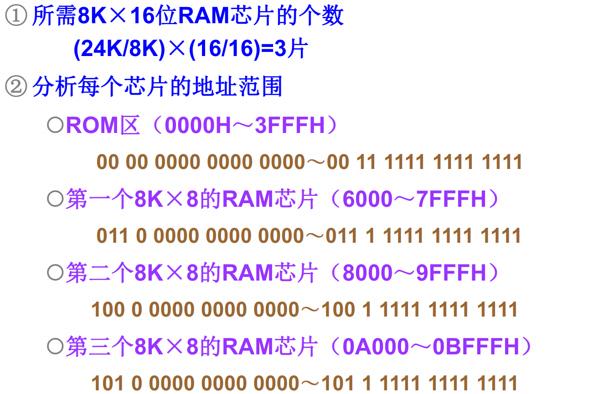

# 存储系统

## 存储器概述

### 存储器分类

按存储介质分类：

* 半导体存储器：使用MOS管组成的存储器
* 磁表面存储器：使用磁性材料做成的存储器
* 光盘存储器：使用光介质构成的存储器

按存取方式分：

* 随机存储器：存取时间和存储单元的物理位置无关：比如半导体存储器

* 顺序存储器：存取时间和存储单元的物理位置有关：比如磁盘存储器

* 半顺序存储器：存取时间部分依赖于存储单元的位置：硬盘

按照存储内容可变性分：

* 只读存储器`ROM`​
* 随机读写存储器`RAM`​

按信息易失性分：

* 易失性存储器：断电后信息即消失的存储器
* 非易失性存储器：断电后仍能保存信息的存储器

按在计算机系统中的作用：

* 主存储器：能够被CPU直接访问，速度较快，用于保存系统在当前运行所需的所有程序和数据。一般情况下使用半导体存储器实现。

* 辅助存储器：不能被CPU直接访问，速度较慢，用于保存系统中所有的程序和数据。

* 高速缓冲存储器：能够直接被CPU访问，速度快，用于保存系统当前运行中频繁使用的程序和数据。

* 控制存储器（寄存器）：CPU内部的存储单元。

### 存储器的分级结构

计算机对存储器的要求：大容量、高速度和低成本。为了解决这个问题，提出了计算机的分级存储结构。

计算机中有着三级存储结构：

缓存——主存结构

主存——辅存结构

1. 加上缓存`cache`​的目的是提高速度
2. 内存包括缓存和主存
3. 多层次的存储结构降低了成本，提高了容量

但是采用分级结构需要解决一些问题：

* 从辅存中寻找指定的内容放入主存应该如何定位？
* 当CPU访问缓存而需要的内容并不在缓存中，应该如何处理？

> 以上的问题由操作系统解决

### 主存储器的技术指标——存储容量

存储容量：存储器中能存放的二进制代码总量

$$
存储容量=储存单元个数 \times 存储字长
$$

### 主存储器的技术指标——存储速度

存取时间：从启动一次访问操作到完成该操作为止所经历的时间。一般以`ns`​为单元，分为读出时间和写入时间。

存取周期：存储器连续启动两次独立的访问操作所需的最小间隔时间。以`ns`​为单元。

$$
存取周期=存取时间+复原时间
$$

存储器带宽：单位时间能够读取或者写入的数据量。

$$
存储器带宽= \frac{每周期的信息量}{周期时长}
$$

### 存储器容量的扩充

单个存储芯片的容量有限，实际存储器由多个芯片扩展而成。

> SRAM、DRAM、ROM均可以进行容量扩充

#### 存储器同CPU的连接

数据、地址、控制三个总线的连接。

那么多个存储芯片同CPU之间的连接应该如何处理？

- 首先不是一一对应连接

- 关注存储器和CPU的外部引脚

- 存储器的容量扩充

#### 存储芯片与CPU的引脚

存储芯片的外部引脚：

- 数据总线：位数和存储单元的字长相同，传输数据信息

- 地址总线，位数和存储单元的个数为$2^n$关系，用于选择存储单元

- 读写信号`WE`：决定当前对芯片的访问类型

- 片选信号`CS`：决定当前芯片是否正在被访问

CPU与存储器连接的外部引脚：

- 数据总线：位数和机器字长相同，用于传输数据信息

> 注意：机器字长和存储单元的字长不一定一致。机器字长往往是存储单元字长的整数倍

- 地址总线：位数与系统中可访问单元个数为$2^n$的关系，用于选择访问单元

- 读写信号`WE`：决定当前CPU的访问类型

- 访存允许信号`MREQ`：内存控制器决定是否允许CPU访问内存

#### 存储器容量的位扩展

存储单元数量不变，每个单元的位数增加。

例：将1Kx4的存储器芯片扩展为1Kx8的存储器芯片：

将地址线增加为原来的两倍，将前四根分配给第一个存储芯片，后四根分配给第二个存储芯片。即：

- 各芯片的地址线直接和CPU的地址线相连

- 各芯片的数据线分别和CPU数据线的不同位相连

- 片选信号和读写线直接和CPU的对应接口相连接。

CPU对存储器的访问是对所有扩展芯片的同一单元的同时访问。

#### 存储器的字扩展

每隔单元的位数不变，但是总的单元个数增加。

例如，使用1Kx8的存储芯片构成2Kx8的存储器：

- 各芯片的地址线和CPU的地位地址线相连

- 数据线和CPU的数据线直接相连

- 读写线直接和CPU的读写线

- 片选信号：片选信号由CPU地址的高位地址和访存信号产生

CPU对于存储器的访问是对于某个扩展芯片的一个单元的访问。

#### 存储芯片的字位扩展

每隔存储单元位数和总的单元个数都会增加。

- 首先进行位扩展，得到满足位要求的存储芯片组

- 再使用存储芯片组进行字扩展

因此，需要计算出需要的存储芯片个数。

如果需要利用$L \times K$的芯片构成$M \times N$的存储系统，需要的芯片个数为：

$$
\frac{M \times N}{L \times K}
$$

#### 存储器容量扩展例题

## SRAM存储器概述

> SRAM: static Random Access Memory

### 主存储器的构成

* SRAM：由MOS电路构成的双稳态触发器保存的二进制信息。
  
  优点：访问速度快，不掉电可以永久保存信息
  
  缺点：集成度低，功耗大，价格高

* DRAM：用MOS电路中的栅极电容保存二进制信息
  
  优点：集成度高，功耗低，价格低
  
  缺点：访问速度慢，电容的放电作用会使信息丢失，需要定期刷新
  
  可以分为SDRAM，DDR SDRAM。

### 基本的静态存储元阵列

基本存储元：由6个MOS管组成，可以存储一位信号。

基本存储元组成存储阵列，但是不一定完全完全按照存储单元形式组织

在封装完成之后，阵列会引出三种控制线

* 地址线：确定需要读写的存储单元
* 数据线：输入输出需要读取写入的数据
* 控制线：控制是读取还是写入

地址线的译码方式有两种：

* 单译码：地址由一根地址线直接指定
* 双译码：地址线由两根地址线共同制定

SRAM存储器的组成结构：

* 存储体：存储单元的集合，将各个存储元组成一个存储矩阵。大容量存储器中，通常使用双译码的方式来确定存储单元。

* 地址译码器：将CPU发出的地址信号转换为确定存储单元的信号

* 驱动器

* 片选：确定当前芯片是否被CPU选中

* 读写电路：读写选定的存储单元

### 读写周期波形图

存储器读写原则：

* 读写信号要在地址信号和片选信号起作用，经过一段时间之后才有效
* 读写信号有效期间不允许地址、数据发生变化
* 地址、数据要维持整个周期内有效

读周期操作过程：

* CPU发出有效的地址信号
* 译码电路产生有效的片选信号
* 读信号控制下，从存储单元中读出数据
* 各个控制信号撤销，数据维持一段时间

读出时间：从地址有效到外部数据总线上数据信号稳定的时间

片选有效时间：从片选信号有效到数据信号稳定的时间

读出信号有效时间：从读出信号到数据信号稳定的时间

​​

写周期操作过程：

* CPU发出有效的地址信号，提供需要写入的数据
* 译码电路延迟产生有效的片选信号
* 写信号控制下，数据写入存储单元中
* 控制信号撤销，数据维持一段时间

​​

## DRAM存储器

DRAM存储器必须定时刷新，维持其中的信息不变。

DRAM的存储元是MOS管和电容组成的记忆电路，利用电容中的电量来表示存储的信息。

### DRAM存储元的记忆原理

利用MOS管控制对于电容的充放电，利用电容中的电量来表示存储的信息。

行线（字线）控制MOS管的开关，位线读出电容中的数据。

### DRAM控制电路的组成

* 地址多路开关：刷新时需要提供刷新地址，非刷新时提供读写地址
* 刷新定时器：定时进行刷新操作
* 刷新地址计数器：刷新按行进行，对所要刷新的行进行计数
* 仲裁电路：对CPU访问存储器的请求和刷新存储器的请求优先级进行仲裁

### DRAM的读写周期

读时序为：

* 行地址信号有效
* 列地址有效
* 读写信号置为读信号
* 输出信号有效

​​

写时序：

* 行地址信号有效
* 列地址有效
* 读写信号置为写信号
* 输入信号有效

​​

### DRAM的刷新周期

在固定的时间内对所有的存储单元，通过读取——写入的方式恢复信息的操作过程，刷新过程中不可进行读写操作。

DRAM的刷新有着以下几种方式：

* 集中式刷新：在一个刷新周期内，利用一段固定时间对存储矩阵中的所有行逐一刷新，在此期间停止所有的读写操作
* 分散式刷新：将系统工作周期分成两部分，前半部分用户读写操作，后半部分用于存储器的刷新
* 异步式刷新：计算需要刷新的频率，在需要刷新的时候再进行刷新操作

### ROM存储器

掩模式ROM：数据在芯片制造的过程中写入，不能更改

- 优点：可靠，集成度高，价格比较低

- 缺点：通用性差，不能改写

一次编程ROM`PROM`:用户第一次使用时写入确定内容

- 优点：用户可根据需要对ROM进行编程

- 缺点：只能编程一次

多次编程ROM：可用紫外光照射`EROM`或者电擦除`EEPROM`，多次改写其中的内容

- 优点：通用性好，可反复使用

闪存存储器`Flash`：一种高密度，非易失性的读写半导体存储器，即常用的U盘

## 高速存储器

### 双端口存储器

双端口存储器采用空间并行技术，同一个存储体使用两组相互独立的读写控制线路，可并行操作。

读写特点：

- 无冲突读写：访问不同的存储单元，可以并行读写存储体

- 有冲突读写：访问同一存储单元，通过特定的信号控制读写的先后顺序
