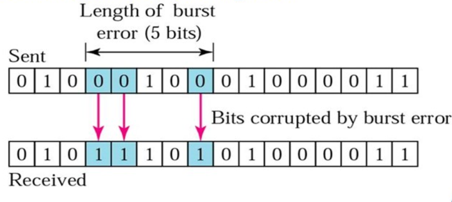
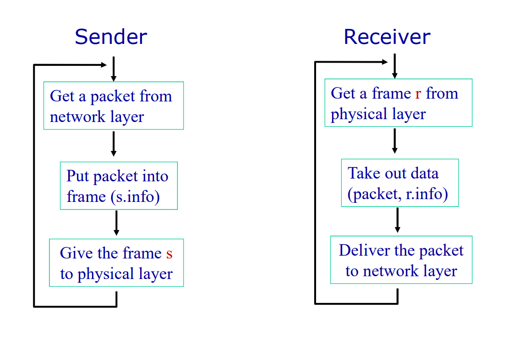
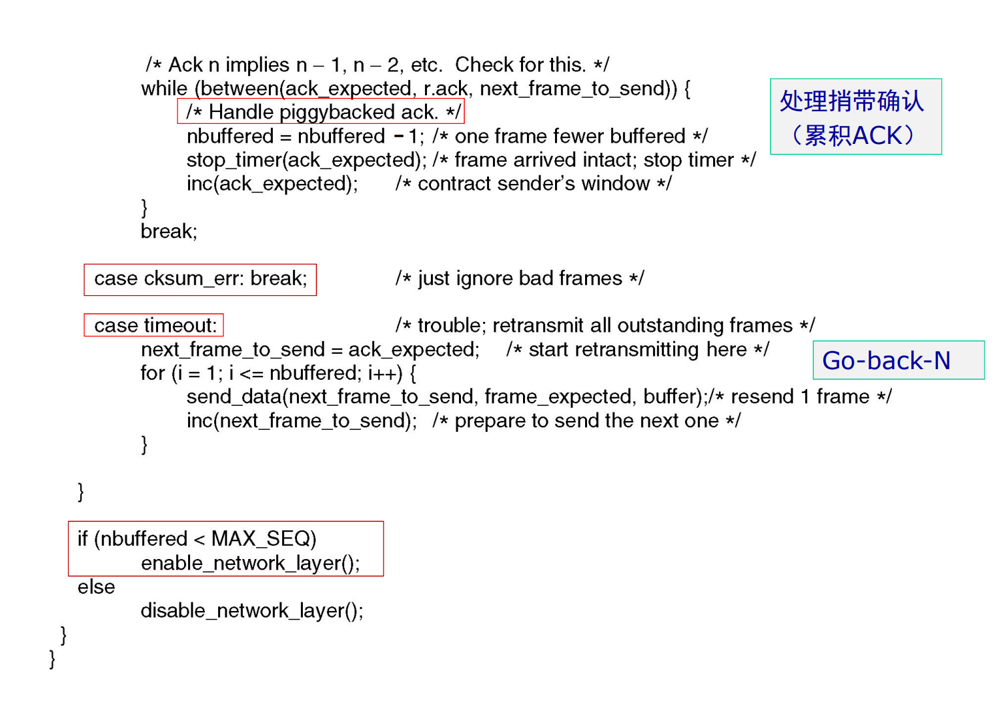
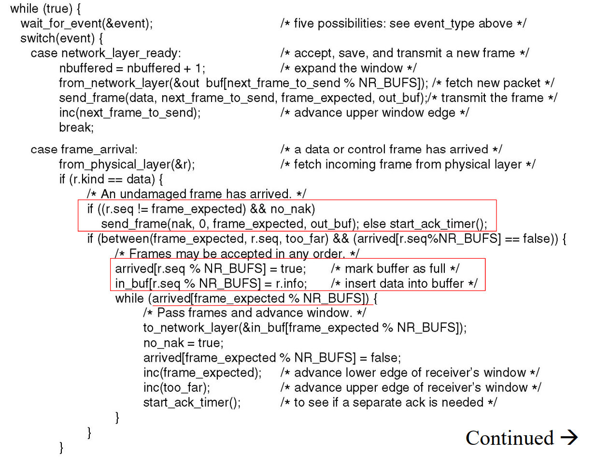

# 数据链路层

## 数据链路层的位置、功能和服务

### 数据链路层和位置和功能

数据链路层负责通过物理层以可靠、高效的方式将数据包（帧）在相邻节点之间传输。

数据链路层提供了打包，流量控制，地址索引，错误控制，介质访问控制等的功能。

> 其中介质访问控制是专属于局域网的技术，主要负责处理数据包广播中遇到的问题，而在广域网中常用点对点链接的方式，故没有相关的问题。

设计目标就是在两个响铃的节点之间实现可靠、高效的通信。

### 封装

​

在数据链路层的封装：将上一层传输过来的**净荷**附加上帧头和帧尾构成一个帧。

数据链路层中的传输是逐级进行的，被称作逐级通信`hop-to-hop communication`​。

### 数据链路层一般由网卡实现

* 发送方：将网络层的包打包为一个帧，在加上错误纠正，可靠传输和流量控制等的功能
* 接收方：首先检验传输过程中是否发生错误，并进行流量控制和可靠传输等的功能
* 数据链路层常常通过硬件实体——网卡实现

### 数据链路层提供的服务

* 无连接的服务：
  
  * 无确认的无连接服务：没有确认帧和逻辑链接，大多数的局域网属于这种方式
  * 有确认的无连接服务：含有一个确认帧，在不可靠的传输信道中应用比较广泛，比如Wi-Fi

* 面向连接的服务：
  
  需要建立连接，每一个传输的帧都会被编号。常见的有`ATM`​和`HDLC`​

## 设计中处理的问题

### 成帧控制

如何从物理层中传输的字节流中识别出不同的帧。

#### 设计成帧功能的要求

* 简单：易于实现
* 透明：同传输的内容无关
* 高效：使用的字节尽量少
* 鲁棒：不易出错，即使出错也应该尽快恢复

#### 字符计数法

​​

在帧头中添加一个表示内容中字符的数量（包括帧头）。但是如果传输的时候帧头中字符数量的字段发生了错误，这个错误不易纠正。

#### 字节/字符填充

在帧的首尾添加标志符以标记帧的开始和结束。标志符往往是传输内容中不常使用的字符。

这种方式实现透明传输比较复杂：因为作为标志符的字符在传输内容中也可能使用。于是为了实现透明传输，在传输内容中使用标志符时需要在前面加上转义字符，通知接受者后面的标志符并不是标志符。

这种方式在`PPP`​协议中得到使用。

这种方式同传输内容的编码方式高度相关，而且往往都是字符编码，直接传输字节就显得不太可能。

#### 比特填充

使用固定的二进制位串位置帧开始和结束的标志：`01111110`​。

但是在传输的数据中也会存在出现标志位串的可能性，于是为了避免这种问题，硬件会在内容中每遇到5个连续的1就在后面添加一个0。在接受方接受数据的时候，每接受到五个连续的1就去掉后面的0。

​​

但是如果在传输的过程中遇到`01110110`​这种位串，其中发生了一次位翻转成为标志位，或者反过来，就可能导致传输错误。

#### 物理层编码违例法

利用物理层编码中违法的编码作为帧的开始和结束标志。

### 错误控制

#### 错误的类型

* 帧丢失：发出的帧就没有达到接收方。这种错误属于流量控制的部分。
* 帧损坏：接受帧的部分比特错误。

单比特错误就是只有一个比特发生了错误。

突发错误意味着至少两个比特在传输过程中发生了错误。突发错误的长度不是指错误比特的数量。

​​

#### 错误的侦测

* 奇偶校验检测单个比特错误
* 循环冗余校验可以检测部分突发性的错误

‍

##### 奇偶校验

通过添加一个奇偶校验位来验证数据的传输过程中是否发生错误。

奇偶校验只能检验奇数的错误。

##### 汉明码

为了校验单个错误需要的校验码位数：

设`m`​表示信息的位数，`r`​表示校验码的位置，`n`​为传输的位置，即`n=m+r`​。

为了纠正单个的错误，需要有下列的不等式成立：

$$
(n+1) 2^m \le 2^n
$$

化简得到：

$$
m+r+1 \le 2^r
$$

为了设计汉明码，首先需要给每一位编号：从左到右，从1开始依次编号。

在编码中，2的次方位（2，4，8，16）是校验码位，剩下的位数就是传输的数据位。

计算的校验码的方式：

##### CRC循环冗余校验

CRC主要用于突发错误的侦测。

将位串当作多项式项目的系数。例如`110001`​就可以写成多项式：

$$
x^5+x^4+x^0
$$

发送方和接收方首先需要约定好一个相同的校验多项式$G(x)$。校验码的位数同校验多项式最高次项的次数相同。

发送方在生成校验码时，首先在数据的后面补上同校验码位数相同的零，再和校验多项式做除法取余数，余数就是生成的校验位。

​

接受方在接收到数据之后利用校验多项式计算除法的余数，如果余数为0则说明传输中没有问题，反之则存在错误。

​`r`​位的校验码可以发现所有长度在`r`​以下的错误。

所有奇数个比特翻转的错误一定能够被发现。

对于长度大于`r`​的错误被遗漏的概率为$2^{-r}$。

#### 错误的纠正

当传输的介质比较可靠的时候，使用错误侦测再进行重传是更加便宜的方式。

当传输的介质不是特别可靠的时候，比如无线网络，最好使用错误纠正码来确保接受者能够纠正少量的错误。

### 流量控制

流量控制的目的就是为了防止接收方被发送方过快的发送阻塞，导致传输的数据丢失。

数据链路层的流量控制都是基于反馈的流量控制，即通过发送方通过接受接受方发送的`ACK`​信息来决定怎么发送数据。

#### 基础流量控制协议

使用`C`​语言编写代码表示协议，定义一个头文件`protocol.h`​：

```java
//
// Created by ricardo on 23-3-17.
//

#ifndef DATA_LINK_LAYER_PROTOCOL_H
#define DATA_LINK_LAYER_PROTOCOL_H

#define MAX_PKT 1024

typedef enum {
    false,
    true
} boolean;

typedef unsigned int seq_nr;

typedef struct {
    unsigned char data[MAX_PKT];
} packet;

typedef enum {
    data,
    ack,
    nck,
} frame_kind;

typedef struct {
    frame_kind kind;
    seq_nr seq;
    seq_nr ack;
    packet info;
} frame;

void wait_for_event(event_type *event);

void from_network_layer(packet *p);

void to_network_layer(packet* p);

void from_physical_layer(packet *p);

void to_physical_layer(packet* p);

void start_timer(seq_nr k);

void end_timer(seq_nr k);

void start_ack_time();

void end_ack_time();

void enable_network_layer();

void disable_network_layer();

#endif //DATA_LINK_LAYER_PROTOCOL_H
```

##### 协议1 乌托邦单工协议

这个协议假设：

* 通信的单工的
* 通信是无错的
* 接收方有着无限的缓存

即：这个协议不需要任何的错误控制和流量控制

​​

```java
//
// Created by ricardo on 23-3-17.
//

typedef enum {
    frame_arrival
} event_type;
#include "protocol.h"

void send() {
    frame s;
    packet buffer;

    while (true) {
        from_network_layer(&buffer);
        s.info = buffer;
        to_physical_layer(&s);
    }
}

void receive() {
    frame r;
    event_type event;

    while (true) {
        wait_for_event(&event);

        from_physical_layer(&r);
        to_network_layer(&r.info);
    }
}
```

##### 协议2 单工发送——等待协议

这个协议假设：

* 通信是单工的
* 通信是没有错误的
* 接受者有着有限的缓存

这个协议使用了一种发送——等待机制：

* 发送方发送数据开始等待
* 接收方接受数据并发送确认帧`ACK`​​
* 发送方收到确认帧，继续发送

​​

```java
//
// Created by ricardo on 23-3-17.
//

typedef enum {
    frame_arrival
} event_type;

#include "protocol.h"

void send()
{
    frame s;
    packet buffer;
    event_type event;

    while (true)
    {
        from_network_layer(&buffer);
        s.info = buffer;
        to_physical_layer(&s);
        wait_for_event(&event);
    }
}

void receive()
{
    frame r, s;
    event_type event;

    while (true) {
        wait_for_event(&event);
        from_physical_layer(&r);
        to_network_layer(&r.info);
        to_physical_layer(&s);
    }
}
```

##### 协议3 带有重试的主动确认协议

如果将协议2应用在不可靠的传输信道上：

* 传输过程中帧损坏了：
  
  接受者可以使用`CRC`​纠错码发现和丢弃这个损坏的帧
  
  发送者在等待`ACK`​帧的过程中超时之后重新发送这个帧

* 传输过程中帧丢失了：
  
  如果是数据帧丢失了：发送者超时之后重新发送
  
  如果是`ACK`​帧丢失了：发送者超时之后重新发送

但是`ACK`​帧丢失之后重传可能遇到一个问题：发送者重新发送的数据帧会被接受者当作是新的数据帧。

​​

为了解决这个问题，我们可以在数据帧的帧头上添加序列编号。

在这里由于实际上只需要两种状态，序列编号只需要一个比特，传输0或者1就可以了。

这样就将这个协议改造成了一个自动重传协议`Automatic Repeat reQuest aka ARQ`​。

这个协议称为：单向传输数据的停止等待ARQ协议

* 发送方在数据帧中添加校验字段，发送之后启动超时定时器
* 接受方在接受数据之后利用校验码检查错误，出错就丢弃数据，校验无误的情况下发送确认帧
* 发送法收到确认帧，发送下一帧，重启定时器
* 如果发送方定时器超时，发送方重新发送刚发送的数据帧
* 在数据帧还携带一个序号，接受方根据序号来判断是否是重复发送的数据帧
* 确认帧中也携带序号，发送方通过序号确定是否是重复的确认帧

‍那么确认帧是必须携带序号吗：

在确认帧发送比较缓慢的时候，缺少序号的确认帧就可能导致问题。


因此确认帧是需要序号的，发送方通过序确认是否是重复的确认帧。

```c
#define MAX_SEQ 1
typedef enum
{
    frame_arrival,
    cksum_err,
    timeout
} event_type;

#include "protocol.h"

void send()
{
    seq_nr next_frame_to_send;
    frame s;
    packet buffer;
    event_type event;

    next_frame_to_send = 0;
    from_network_layer(&buffer);
    while (true)
    {
        s.info = buffer;
        s.seq = next_frame_to_send;
        to_physical_layer(&s);
        start_timer(s.seq);
        wait_for_event(&event);

        if (event == frame_arrival)
        {
            from_physical_layer(&s);
            if (s.ack == next_frame_to_send)
            {
                stop_timer(s.ack);
                from_network_layer(&buffer);
                next_frame_to_send = 1 - next_frame_to_send;
            }
        }
    }
}

void receive()
{
    seq_nr frame_expected;
    frame r, s;
    event_type event;

    frame_expected = 0;
    while (true)
    {
        wait_for_event(&event);

        if (event == frame_arrival)
        {
            from_physical_layer(&r);
            if (r.seq == frame_expected)
            {
                to_network_layer(&r.info);
                frame_expected = 1 - frame_expected;
            }
            s.ack = 1 - frame_expected;
            to_physical_layer(&s);
        }
    }
}
```

##### 协议4 实用的停止等待ARQ协议

设计原则：

- 在数据帧中增加校验字段，发送帧之后启动超时定时器

- 接收方对于收到的数据进行校验，如果出错则丢弃，如果校验无错，就发送确认帧或者通过下一个帧进行捎带确认

- 收到确认之后发送下一帧，重启定时器

- 如果定时器超时，则重新发送刚发送的数据帧

- 数据帧中携带发送序号，根据需要判断是否需要是重复的数据帧

- 根据确认帧判断是否重复的确认帧

捎带应答：

当收到一个数据帧时，不同于立刻发送一个确认帧，而是等待网络层给出下一个需要发送的数据包，并把确认帧附在需要发送的数据帧之后一同发送出去。

在这个过程中，发送方和确认方都需要维持一个滑动窗口。

```c
#define MAX_SEQ 1
typedef enum
{
    frame_arrival,
    cksum_err,
    timeout
} event_type;

#include "protocol.h"

void protocol()
{
    seq_nr next_frame_to_send;
    seq_nr frame_expected;

    frame r, s;
    packet buffer;
    event_type event;

    from_network_layer(&buffer);
    s.info = buffer;
    s.seq = next_frame_to_send;
    s.ack = 1 - frame_expected;
    to_physical_layer(&s);
    start_timer(s.seq);

    while (true)
    {
        wait_for_event(&event);

        if (event == frame_arrival)
        {
            from_physical_layer(&r);

            if (r.seq = frame_expected)
            {
                to_network_layer(&r.info);
                frame_expected = 1 - frame_expected;
            }

            if (r.ack == next_frame_to_send)
            {
                stop_timer(r.ack);
                from_network_layer(&buffer);
                next_frame_to_send = 1 - next_frame_to_send;
            }

            s.info = buffer;
            s.seq = next_frame_to_send;
            s.ack = 1 - frame_expected;
            to_physical_layer(&s);
            start_timer(s.seq);
        }
    }
}
```

但是这个协议的效率非常的低。

在大部分的时间里，使用这个协议的信道都被阻塞等待确认帧。

##### 协议5 回退N步协议

设计原则：

- 发送方和接收方都需要维持一个滑动窗口：
  
  发送窗口： 发送帧的缓冲队列
  
  接受窗口：接受帧的缓冲队列

- 发送者将被允许在收到确认帧之前发送多个数据帧

- 如果接收方发现了传输错误，那么发送方必须回退到这个错误的帧重发进行纠错，已经发送的数据帧就废弃了

‍发送窗口大小的约束：

当序号的位数只有$n$时，假设发送窗口的大小达到$2^n$。

如果发送方发送所有可以发送的帧，而接收方在接受所有的数据之后发送确认帧时失败了，但是此时接受者的序号和发送者的序号相同，接受者会把发送者重新发送的帧当作新发送的帧接受。


‍因此该协议的发送窗口大小必须满足：

$$
Window Size \le 2^n - 1
$$

式子中的`n`表示序号的位数。

协议5的示例实现：




##### 协议6 选择重传协议

`Select Repeat/Select Reject`。

接收方的缓存大于1，可以接受乱序的帧，并且只要求重传错误的帧。

选择重传中对于窗口大小的限制：

- 发送窗口和接受窗口大小之和不能大于$2^n$:

$$
w_s + w_r \le 2^n
$$

- 发送窗口的大小大于接受窗口的大小

- 一般来说，取发送窗口和接受窗口大小为$2^{n-1}$

协议6相对于协议5的改进：

- 设置确认帧定时器：
  
  在收到数据帧之后，等待一段时间的回传帧以进行捎带确认。如果定时器超时还没有等到回传的数据，直接发送确认帧。
  
  利用这种方式减少单独确认帧的发送，提高信道的使用效率。

- `NAK`帧：对于同一帧的错误，发送一次NAK
  
  NAK帧的序号就是出错帧的序号。
  
  帧接受之后校验出错和序号不对都算是出错。

协议6的示例实现：





#### 协议效率的分析

为了比较不同的协议效率的不同，一般采用**最大信道利用率**来描述一个协议的效率。

##### 停等协议的效率

发送数据帧的总时间：

$$
T_F = T_{tran} + T_{prop} + T_{proc} + T_{ack} + T_{prop} + T_{proc}
$$

一般来说认为处理时间和发送确认帧的时间是可以忽略不计的，所以总的时间就是：

$$
T_F = T_{tran} + 2 T_{prop}
$$

计算出信道利用率：

$$
U=\frac{T_{tran}}{2 T_{prop} + T_{tran}}
$$

因此当传播延迟$T_{prop}$越小，信道的利用率越高。


## 示例协议

‍
