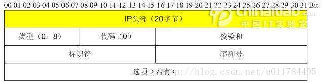

# 实验二-抓包

## 实验内容和实验环境描述

 ### 实验环境

系统环境：Windows 10、 Ubuntu 23.04（几个指令所访问的，自己的服务器）

所用软件：wireshark 4.0.3、浏览器、cmd

报告撰写：typora

 ### 实验任务

- 捕获 DHCP 报文并分析 
- 发送 ICMP 报文，捕获并分析格式 
- 分析 IP 数据报的分片传输过程 
- 捕获建立连接和释放连接过程的 TCP 报文段并分析 

 ### 实验内容

如下


 ##DHCP

 ### DHCP概述

DHCP（Dynamic Host Configuration Protocol，动态主机配置协议），使用UDP协议工作。端口为：67（服务器端），68（客户端）

简单来说，DHCP就是一个不需要账号密码登录的、自动给内网机器分配IP地址等信息的协议。

DHCP一共有8中报文，各种类型报文的基本功能如下：

| 报文类型         | 说明                                                         |      |
| ---------------- | ------------------------------------------------------------ | ---- |
| Discover （0x01) | DHCP客户端在请求IP地址时并不知道DHCP服务器的位置，因此DHCP客户端会在本地网络内以广播方式发送Discover请求报文，以发现网络中的DHCP服务器。所有收到Discover报文的DHCP服务器都会发送应答报文，DHCP客户端据此可以知道网络中存在的DHCP服务器的位置。 |      |
| Offer（0x02）    | DHCP服务器收到Discover报文后，就会在所配置的地址池中查找一个合适的IP地址，加上相应的租约期限和其他配置信息（如网关、DNS服务器等），构造一个Offer报文，发送给DHCP客户端，告知用户本服务器可以为其提供IP地址。但这个报文只是告诉DHCP客户端可以提供IP地址，最终还需要客户端通过ARP来检测该IP地址是否重复。 |      |
| Request（0x03）  | DHCP客户端可能会收到很多Offer请求报文，所以必须在这些应答中选择一个。通常是选择第一个Offer应答报文的服务器作为自己的目标服务器，并向该服务器发送一个广播的Request请求报文，通告选择的服务器，希望获得所分配的IP地址。另外，DHCP客户端在成功获取IP地址后，在地址使用租期达到50%时，会向DHCP服务器发送单播Request请求报文请求续延租约，如果没有收到ACK报文，在租期达到87.5%时，会再次发送广播的Request请求报文以请求续延租约。 |      |
| ACK（0x05）      | DHCP服务器收到Request请求报文后，根据Request报文中携带的用户MAC来查找有没有相应的租约记录，如果有则发送ACK应答报文，通知用户可以使用分配的IP地址。 |      |
| NAK（0x06）      | 如果DHCP服务器收到Request请求报文后，没有发现有相应的租约记录或者由于某些原因无法正常分配IP地址，则向DHCP客户端发送NAK应答报文，通知用户无法分配合适的IP地址。 |      |
| Release（0x07）  | 当DHCP客户端不再需要使用分配IP地址时（一般出现在客户端关机、下线等状况）就会主动向DHCP服务器发送RELEASE请求报文，告知服务器用户不再需要分配IP地址，请求DHCP服务器释放对应的IP地址。 |      |
| Decline（0x04）  | DHCP客户端收到DHCP服务器ACK应答报文后，通过地址冲突检测发现服务器分配的地址冲突或者由于其他原因导致不能使用，则会向DHCP服务器发送Decline请求报文，通知服务器所分配的IP地址不可用，以期获得新的IP地址。 |      |
| Inform（0x08）   | DHCP客户端如果需要从DHCP服务器端获取更为详细的配置信息，则向DHCP服务器发送Inform请求报文；DHCP服务器在收到该报文后，将根据租约进行查找到相应的配置信息后，向DHCP客户端发送ACK应答报文。目前基本上不用了。 |      |


 ### 抓包操作

 #### release：释放IP


报文内容

```hex
0000   10 4f 58 6c 0c 00 48 51 c5 5e 4e 71 08 00 45 00
0010   01 48 e1 bf 00 00 80 11 00 00 0a 1c a6 5b 0a 03
0020   09 02 00 44 00 43 01 34 c4 c1 01 01 06 00 15 ad
0030   10 b0 00 00 00 00 0a 1c a6 5b 00 00 00 00 00 00
0040   00 00 00 00 00 00 48 51 c5 5e 4e 71 00 00 00 00
0050   00 00 00 00 00 00 00 00 00 00 00 00 00 00 00 00
0060   00 00 00 00 00 00 00 00 00 00 00 00 00 00 00 00
0070   00 00 00 00 00 00 00 00 00 00 00 00 00 00 00 00
0080   00 00 00 00 00 00 00 00 00 00 00 00 00 00 00 00
0090   00 00 00 00 00 00 00 00 00 00 00 00 00 00 00 00
00a0   00 00 00 00 00 00 00 00 00 00 00 00 00 00 00 00
00b0   00 00 00 00 00 00 00 00 00 00 00 00 00 00 00 00
00c0   00 00 00 00 00 00 00 00 00 00 00 00 00 00 00 00
00d0   00 00 00 00 00 00 00 00 00 00 00 00 00 00 00 00
00e0   00 00 00 00 00 00 00 00 00 00 00 00 00 00 00 00
00f0   00 00 00 00 00 00 00 00 00 00 00 00 00 00 00 00
0100   00 00 00 00 00 00 00 00 00 00 00 00 00 00 00 00
0110   00 00 00 00 00 00 63 82 53 63 35 01 07 36 04 0a
0120   03 09 02 3d 07 01 48 51 c5 5e 4e 71 ff 00 00 00
0130   00 00 00 00 00 00 00 00 00 00 00 00 00 00 00 00
0140   00 00 00 00 00 00 00 00 00 00 00 00 00 00 00 00
0150   00 00 00 00 00 00
```

 ##### 其他包头

 ###### UDP头

后面的DHCP包头中此字段类似，不再展示


```
0020   			00 44 00 43 01 34 c4 c1
```

| Hex值 | 字段类型  | 含义       |
| ----- | --------- | ---------- |
| 00 44 | 源端口    | 端口68     |
| 00 43 | 目的端口  | 端口67     |
| 01 34 | udp包长度 | udp包长300 |
| c4 c1 | 校验和    | 0xc4c1     |


 ###### IP头（略）

具体分析内容**见后面分析IP数据包的部分**

（可以看到IP包长度328=UDP的308+20）


 ###### 以太网头：

后面的DHCP包头中此字段类似，不再展示


```
0000   10 4f 58 6c 0c 00 48 51 c5 5e 4e 71 08 00 
```

| Hex值             | 字段类型      | 含义             |
| ----------------- | ------------- | ---------------- |
| 10 4f 58 6c 0c 00 | 源MAC地址     | 48位MAC地址      |
| 48 51 c5 5e 4e 71 | 目的源MAC地址 | 48位MAC地址      |
| 08 00             | 协议类型      | 上层使用IPv4协议 |

注意长度为14字节，因此包总长度342=IP的328+14


 ##### DHCP报文内容


```
0020								 01 01 06 00 15 ad
0030   10 b0 00 00 00 00 0a 1c a6 5b 00 00 00 00 00 00
0040   00 00 00 00 00 00 48 51 c5 5e 4e 71 00 00 00 00
0050   00 00 00 00 00 00 00 00 00 00 00 00 00 00 00 00
0060   00 00 00 00 00 00 00 00 00 00 00 00 00 00 00 00
0070   00 00 00 00 00 00 00 00 00 00 00 00 00 00 00 00
0080   00 00 00 00 00 00 00 00 00 00 00 00 00 00 00 00
0090   00 00 00 00 00 00 00 00 00 00 00 00 00 00 00 00
00a0   00 00 00 00 00 00 00 00 00 00 00 00 00 00 00 00
00b0   00 00 00 00 00 00 00 00 00 00 00 00 00 00 00 00
00c0   00 00 00 00 00 00 00 00 00 00 00 00 00 00 00 00
00d0   00 00 00 00 00 00 00 00 00 00 00 00 00 00 00 00
00e0   00 00 00 00 00 00 00 00 00 00 00 00 00 00 00 00
00f0   00 00 00 00 00 00 00 00 00 00 00 00 00 00 00 00
0100   00 00 00 00 00 00 00 00 00 00 00 00 00 00 00 00
0110   00 00 00 00 00 00 63 82 53 63 35 01 07 36 04 0a
0120   03 09 02 3d 07 01 48 51 c5 5e 4e 71 ff 00 00 00
0130   00 00 00 00 00 00 00 00 00 00 00 00 00 00 00 00
0140   00 00 00 00 00 00 00 00 00 00 00 00 00 00 00 00
0150   00 00 00 00 00 00
```


| Hex值                                                        | 字段类型                                                     | 含义                                                         |
| ------------------------------------------------------------ | ------------------------------------------------------------ | ------------------------------------------------------------ |
| 01                                                           | OP:操作类型                                                  | 01：发送给服务器的操作报文<br/>若为02，则是服务器发送的应答报文 |
| 01                                                           | Htype:客户端的MAC地址类型                                    | 01：以太网地址                                               |
| 06                                                           | Hlen:MAC地址长度                                             | 以太网地址长度为6                                            |
| 00                                                           | Hops:经过DHCP中继的数目                                      | 未经过中继                                                   |
| 15 ad 10 b0                                                  | Xid:用来标识请求的随机数                                     | 无意义                                                       |
| 00 00                                                        | Secs：DHCP客户端开始请求后的时间，以秒为单位                 | 此字段未使用，固定为0                                        |
| 00 00                                                        | Flags：是否广播标志位，只使用最高一个比特                    | 80：广播发送（申请ip时）<br />00，单播发送（释放/续约ip时）  |
| 0a 1c a6 5b                                                  | Ciaddr：DHCP客户端的IP地址                                   | 仅在释放、续约中有值，此处为我电脑的IP:10.28.166.91          |
| 00 00 00 00                                                  | Yiaddr：DHCP服务器分配给客户端的IP地址                       | 仅在DHCP服务器发送的Offer和ACK报文中显示，其他报文中显示为0  |
| 00 00 00 00                                                  | Siaddr：下一个为DHCP客户端分配IP地址等信息的DHCP服务器IP地址 | 仅在DHCP Offer、DHCP ACK报文中显示，其他报文中显示为0        |
| 00 00 00 00                                                  | Giaddr：DHCP客户端发出请求报文后经过的第一个DHCP中继的IP地址。 | 如果没有经过DHCP中继， 则显示为0                             |
| 48 51 c5 5e 4e 71                                            | Chaddr：DHCP客户端的MAC地址                                  | 由于服务器唯一标识客户端                                     |
| 00 00 00 00   00 00 00 00 00 00                              | Chaddr padding：硬件地址最长可达16字节，以太网地址只使用了6字节，所以这里扩展到16 | 无意义，且不一定存在，为填充长度的内容                       |
| 00 00 00 00 00 00 00 00 00 00 00 00 <br />00 00 00 00 00 00 00 00 00 00 00 00 <br />00 00 00 00 00 00 00 00 00 00 00 00 <br />00 00 00 00 00 00 00 00 00 00 00 00 <br />00 00 00 00 00 00 00 00 00 00 00 00 <br />00 00 00 00 | Sname：为DHCP客户端分配IP地址的DHCP服务器名称                | DNS域名格式，在Offer和ACK报文中显示发送报文的DHCP服务器名称（如有域名，比如学校这个内网服务器只有ip，的这个字段就一直是空的） |
| 00 00 00 00 00 00 00 00 00 00 00 00 <br />00 00 00 00 00 00 00 00 00 00 00 00 <br />00 00 00 00 00 00 00 00 00 00 00 00 <br />00 00 00 00 00 00 00 00 00 00 00 00 <br />00 00 00 00 00 00 00 00 00 00 00 00 <br />00 00 00 00 00 00 00 00 00 00 00 00 <br />00 00 00 00 00 00 00 00 00 00 00 00 <br />00 00 00 00 00 00 00 00 00 00 00 00 00 00 00 00 00 00 00 00 00 00 00 00 00 00 00 00 00 00 00 00 00 00 00 00 00 00 00 00 00 00 00 00 | File：DHCP服务器为DHCP客户端指定的启动配置文件名称及路径信息 | 仅在DHCP Offer报文中显示（不一定有）                         |
| ………………                                                       | Options： 可选项字段                                         | ，长度可变，格式为"代码+长度+数据"。                         |


 #### renew：获取IP

DHCP的工作流程


DHCP具体的报文格式在上面已经分析展示过了，下面就只例举工作流程中变化的几个关键字段

 ##### DHCP Discover

- 首先，此时我的电脑是没有获取IP地址的，也不知道该向谁请求IP分配，因此设置以太网的目的为全f，即广播地址


同样的原因，这整个流程中，客户端发出的DHCP包的source IP都是0.0.0.0。


- DHCP字段中，设置发送方式为广播


- 并说明自己的MAC地址


即，向所在网络上的所有主机发出一个请求获取IP的DHCP包

 ##### DHCP Offer

- 以太网字段中，源是DHCP服务器的地址（说明学校这个服务器还是阿鲁巴的）。目的是之前Discover中填写的本机MAC


- 此时由于客户端没有ip，服务器必须也以广播方式发送给所有的主机，因此目的ip是广播的255


- 此时，服务器其实已经从它的空闲ip中取出了对应的信息，拟定分配给这个客户端（使用MAC地址标识），在Yiaddr字段填上了打算分配的ip（由于我是释放之后立即申请，所以其实不是分配新的，而是从已分配的表里取到了这个ip然后发给我，不过流程是一样的）


- 同时说明这个操作经过了局域网（总DHCP服务器10.3.9.2，到10.28.128.0/17这个局域网主机）的中转
- 同时，还携带了多个有用的optional字段


 如这里：
  - DHCP服务器IP：10.3.9.2
  - 分配到的这个ip的有效时长：7200s，两小时
  - 所在子网的掩码：17位
  - 子网的路由器地址：10.28.128.1
  - 所在网络的域名服务器：.44和.45（也就是学校的俩总ns服务器）

 ##### DHCP Request

此时客户端已经收到了一个或多个DHCP服务器打算分配给自己的地址，并从中选择一个，发送request包，表示自己打算使用这个ip（学校的环境可能是只有一个服务器，所以没有体现出这个选择？），其他的ip仍然属于服务器

- 由于这个报文需要告知可能的多个服务器说自己选择了哪个ip，因此目的地全部是广播


- 仍然以客户端ip作为标识


- 最重要的，通过option的这个字段说明自己选中的是哪个ip


- 顺带表示自己的主机名


 ##### DHCP ACK

现在，提供的ip被客户端选中的那个服务器收到request之后，确定将这个ip分配出去，在自己表里记录；而其他的服务器将之前拟分配的ip放回去。

- 以太网地址确定是给那一个客户端，但是这个ACK报文还是需要给整个网络发送，以防万一


- 最后一次确认，告知客户端它的ip


- 消息类型为ACK，客户端收到这一条之后就可以放心使用分配到的ip了（如果没人静态ip撞了的话）


 #### 租期续约

由于写上面的内容耗时比较长，刚好等到了一次续约租期的请求，虽然不是要求的内容，但是这里也展示一下

- Transaction ID改变了（最下面两个）
- 

- 消息类型仍然是request


- 发送类型变成了单播，只给分配的ip的那个服务器发送


- Ciaddr字段有值了


- ACK包与之前获取ip时的ACK内容一模一样，只有ip地址从广播变成了单播

对比之前分配ip过程中的情况，，可以发现除了上面这几点基本没啥变化。

所以我觉得，可以认为租期续约的请求基本和获取IP时request+ACK这个两个包类似，只不过是从广播变成了单播


 ## ICMP

 ### ICMP概述

ICMP是 Internet Control Message Protocol 的缩写，即互联网控制消息协议。

ICMP属于网络层的一部分，分为两大类，查询报文和差错报文

 ### 抓包操作

指令：ping www.baidu.com


可以观察到，两条消息一组，共4组

这里以第一组为例：

 #### ip包头

以太网头和UDP头在前面分析过了，这里再具体看一下IP包头


```
0000   											45 00 
0010  00 3c 07 f4 00 00 40 01 00 00 0a 1c a6 5b 27 9c
0020  42 0e
```

| Hex值               | 字段类型                                                   | 含义                                                         |
| ------------------- | ---------------------------------------------------------- | ------------------------------------------------------------ |
| 4                   | 版本号                                                     | 半个byte，4即ipv4，如果是6就是ipv6                           |
| 5                   | 首部长度                                                   | 5，但不是5byte。<br />这里的单位是32bit，也就是有5*4=20byte  |
| 00                  | ToS：服务类型                                              | 不做详细说明，这里全为0                                      |
| 00 3c               | 总长度                                                     | ip数据报的总长度，这里为0x3c=60byte                          |
| 07 f4               | 标识符                                                     | 随机选择的数值，无意义。在分段时需相同                       |
| 000[B]              | 标志位（由于它以bit为单位，因此这一栏和下一栏均是bit描述） | 用于分段时表示，依次为：首个bit不适用，第二个是DF，第三个是MF |
| 0 0000 0000 0000[B] | 片偏倚                                                     | 分段的片的偏移量。具体说明见后面ip分段的部分                 |
| 40                  | TTL                                                        | 可生存的路由跳数，减为0时路由器丢弃                          |
| 01                  | 协议                                                       | 01即ICMP协议                                                 |
| 00 00               | 校验和                                                     | 这里为0，是因为交给了网卡进行硬件层面的校验，提高速度        |
| 0a 1c a6 5b         | 源IP                                                       | 这里为我电脑的ip 10.28.166.91                                |
| 27 9c 42 0e         | 目的IP                                                     | 这里为ping的目的ip，百度的39.156.66.14                       |
| ……                  | optional                                                   | 可选项，icmp这里没有                                         |
| ……                  | padding                                                    | 如果有可选项，需要填充包头至32位的倍数                       |

 #### ICMP报文



这里讲跟在ip包头20字节后的内容

```
0020         08 00 4d 5a 00 01 00 01 
```

| Hex值 | 字段类型 | 含义                                                         |
| ----- | -------- | ------------------------------------------------------------ |
| 08    | 类型     | 表示ICMP报文的类型，08表示Echo (ping) request                |
| 00    | 代码     | 对应ICMP报文的代码，与上一字节共同确定ICMP报文的类型         |
| 4d 5a | 校验和   | 整个ICMP报文的校验和，包含IP包头                             |
| 00 01 | 标识     | 仅适用于回显请求和应答ICMP报文，用于标识本ICMP进程。<br />在一次请求与回显中一致，在一次ping中一共有四个不同的值 |
| 00 01 | 序列号   | 标识一的ping中的多次请求。每发送一次就加一，用来确定是否有丢包 |

ICMP的data部分，这里是abcdefg……

```
0020   								 61 62 63 64 65 66
0030   67 68 69 6a 6b 6c 6d 6e 6f 70 71 72 73 74 75 76
0040   77 61 62 63 64 65 66 67 68 69

```


响应的数据报：type变成0，其余的icmp字段无变化

 ##### IPv6 ping

指令：ping nginx.show  （[2001:da8:215:3c02:8e1d:96ff:fef1:f2e3]）


和v4的基本相同，icmp报文部分只有类型字段从08变成了80，响应的类型变成了81


 ## ip数据报的分段传输

 #### 抓包操作


制定8000字节数据，ping一次：`ping 10.3.9.2 -l 8000 -n 1`


设置wireshark过滤条件**：`ip.src eq 10.3.9.2 or ip.dst eq 10.3.9.2`**

ip包头前面分析过了，这里主要看ip包头中，与分段-重组相关的几个地方

| 二进制值         | 字段类型 | 含义                                                         |
| ---------------- | -------- | ------------------------------------------------------------ |
| 0                | 未使用   | 无意义                                                       |
| 0                | DF       | **这个数据报不分段，如果超出了某一跳链路的MTU，就直接发送失败** |
| 1                | MF       | **这一个包不是最后一个时设置，表示还有更多的包**             |
| 0 0000 0000 0000 | 片偏倚   | 分段的片的偏移量                                             |
| 99 c6            | 标识符   | 同一个包的多个分段中，此值相同                               |

 ##### 第一个包：


如图，MF设置为1，表示后续还有分段的片


偏移量为0，表示是第一个片

 ##### 第二个包


flag同上


**注意偏移量**

**这里偏移量实际值是1011 1001，为185，而不是这里wireshark给出的1480（以太网MTU=1500，减去IP包头20字节，因此ip的数据MTU为1480）**

**实际上这里的偏移量单位是8个byte，也就是这个片在整个数据报中，开始的位置是185*8=1480。**

**那么为什么有这个8byte的倍率呢——ip包头中，总长度字段是16字节的**

而这里片偏移只有13字节，如果表示分片的精确起始位置的话是不够用的，于是就选择用偏倚的一个bit映射了包总长度的最低3个bit，也就是这个8倍的关系

**也因此，当包分段时，要满足网络层数据+包头小于链路MTU，而且数据的长度得是8的整数倍**

其余的包都和第二个类似。

| 第几个包 | 包长度 | DF   | MF   | Offest | 段标识符 |
| -------- | ------ | ---- | ---- | ------ | -------- |
| 1        | 1500   | 0    | 1    | 0      | 99 c6    |
| 2        | 1500   | 0    | 1    | 185    | 99 c6    |
| 3        | 1500   | 0    | 1    | 370    | 99 c6    |
| 4        | 1500   | 0    | 1    | 555    | 99 c6    |
| 5        | 1500   | 0    | 1    | 740    | 99 c6    |
| 6        | 628    | 0    | 0    | 925    | 99 c6    |

（Offset写的是原始二进制值，换算成bit偏移量需要再乘8）

 ##### 最后一个包


可以看到，flag中，MF字段变为0，表示它就是这个identification（0x99c6）所对应的最后一个包，主机收到之后就可以将它组装起来了，每个包放在偏移量\*8的位置上即可，比如这个放在925*8=7400bit的位置上


 ## TCP建立连接和释放连接

通过浏览器访问网址 nginx.show，并捕获、分析TCP协议过程

 ### 三次握手

如图，本机端口12971和服务器端口80之间的三次握手


 #### 第一次握手：SYN n


客户端给服务器发送一个SYN段(在 TCP 标头中 SYN 位字段为 **1** 的 TCP/IP 数据包),

该段中也包含客户端的初始序列号(Sequence number = J)，此例中客户端初始序列号为0，因此是SYN 0。

 #### 第二次握手：ACK n+1,SYN m


服务器返回客户端 SYN +ACK 段(在 TCP 标头中SYN和ACK位字段都为 1 的 TCP/IP 数据包)， 该段中包含服务器的初始序列号(Sequence number = K)。

同时使 Acknowledgment number = J + 1来表示确认已收到客户端的 SYN段(Sequence number = J)。

此例中，ACK 1，服务器序列号也恰为0，因此SYN 0


 #### 第三次握手：ACK M+1


客户端给服务器响应一个ACK段(在 TCP 标头中 ACK 位字段为 **1** 的 TCP/IP 数据包), 该段中使 Acknowledgment number = K + 1来表示确认已收到服务器的 SYN段(Sequence number = K)。

此例中，为ACK 1


 #### 后续请求

之后，双方就使用seq=1来开始通信

比如这里握手之后，客户端第一次请求GET


seq为握手之后的1，负载的http请求长度为470


服务器的响应，seq=1，ack=471（get请求的tcp长度+1）


客户端再次请求


seq变为上次ack的471，同时捎带确认上面一个http 301的374序号


 #### 时空图


 ### 四次挥手


如图，本机端口1388和服务器端口80，执行四次挥手（第一条理论上是FIN，但是这里多带了ACK，应该是捎带确认了之前发的包，seq号是符合的）

 #### 第一次挥手


（不知道为啥，我这里是由服务器主动发起的fin，也就是那个80，1388是本机端口。不过不影响，分析的流程是一样的，只是调换学的客户端与服务器角色）

服务器发起终止，设置**FIN，seq=1**。（ACK 2与挥手无关，是对之前的捎带确认）

服务器等待来自客户端的确认

 #### 第二次挥手


本机返回ACK包，设置**ACK 2**，**即上一个FIN的seq+1**

等待1388这个socket的链接处理完了其他事情后，发送FIN

在此期间内是**仍然可以单方面的向对方发送数据**的，直到要发的发完了，主动的给出一个FIN表示这边同意终止。

 #### 第三次挥手


本机向服务器发送**ACK+FIN**包，设置**ACK 2，FIN 2**，这里的**ack与上一个相同，seq号自己指定**

表示本机做好准备终止TCP链接了，发送出最后一个FIN包。此后如果收到了对面的ACK，就不再使用此连接发送，否则的话认为是这个FIN丢包，就不断重发

 #### 第四次挥手


服务器发出ACK包，为**ACK 3**，即本机发往服务器FIN 2的序号+1，进入最后的TIME_WAIT状态

此状态持续两个MSL（Maximum Segment LifeTime 报文最大生存时间  2MSL即数据报来回的最大时间），如果此期间内没有收到重传的FIN，就认为成功终止了TCP连接；如果再次收到，就说明ACK丢包了，重新做出响应。


 #### 时空图


 ## 实验结论和实验心得

用时大约5小时

在做实验之外，重新理解了一下各个协议的实现、字段，以及一些需要注意的点，起到了一些复习的作用，对网络层协议的理解更深入了。

不过像拥塞控制、路由等，与实际发包/抓包无关的内容还需要专门复习

另外发现对于TCP的握手和挥手的过程还是不太熟悉，需要再加强一下


