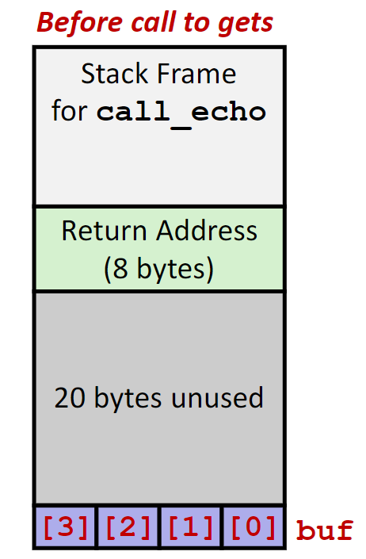

# assembly-advanced

# 程序的机器级表达——高级话题

## Linux内存分配


内存中一般被分配为下列积几个部分：

- 栈

  - 程序运行时的栈大小，一般最大的栈为8MB
  - 程序中的本地变量一般就放在这个地方
- 堆

  程序中按照需要分配的动态内存空间，比如`malloc`和`new`分配的空间。
- 数据

  静态数据存放的空间，比如程序中的全局变量，静态变量，还有程序中的字符串常量。
- 共享库

  程序共享的运行时库的存储位置，只读的可执行代码。

  一些比较大块的内存分配也会在这里进行。

### 栈溢出例子

```c
int recurse(int x)
{
    int a[1<<15];
    printf("x = %d. a at %p\n", x, a);
    a[0] = (1<<14)-1;
    a[a[0]] = x-1;
    if (a[a[0]] == 0)
    {
        return -1;
    }
    return recurse(a[a[0]] - 1);
}
```

这个递归函数每次在运行的时候都会在栈上分配128KB的空间，当递归次数太多的时候，这个程序就会崩溃推出，报出`Segmentation fault`。

## 缓存溢出

### 漏洞

在访问数组的时候，访问的地址超过数组分配的空间，就被称为缓存溢出漏洞。

在一般情况下，输入字符串的程序十分容易出现这个问题，输出的字符串长度很容易超过程序中分配空间的大小。尤其是如果输入的字符串中包含一些可执行的二进制代码，就会让程序执行一些意外的代码，而往往这些代码不会是善良的。

#### 木马、蠕虫和病毒

这是三种不同种类的恶意软件，在最开始是按照他们的传播方式分类的，但是随着时间的流逝，三者之间的界限正在变得模糊。

- 木马：通过引诱人们进行点击进行传播的软件，往往在电子邮件附件和网络中下载的文件中发现
- 蠕虫：可以自行进行复制和传播，这个过程是完全自动的
- 病毒：夺取已安装软件的控制权

#### 库函数

在C语言中存在不少关于字符串和输入的库函数都是不安全的。比如下面的这个例子`gets`函数

```C
char* gets(char* dest)
{
	int c = getchar();
    char *p = dest;
    while(c != EOF && c != '\n')
    {
        *p++ = c;
        c = getchar();
    }
    *p = '\0';
    return dest;
}
```

仔细分析这个函数，没有任何对于输入字符数量的限制，如果输入的字符数量大于了传入函数的数组大小，输入的字符就会开始破坏栈上的数据。

`scanf`和类似的`sscanf`、`fscanf`函数在处理`%s`的时候也存在类似的问题。

`strcpy`、`strcat`两个字符串操作函数也存在着相同的问题。

#### 溢出攻击的原理

我们先给出一个存在溢出攻击可能的函数：

```c
void echo()
{
	char buf[4];
    gets(buf);
    puts(buf);
}
```

我们在下面这个函数中调用`echo`函数：

```c
void call_echo()
{
	echo()
}
```

为了方便分析，先给出这两个函数的汇编代码：

```nasm
00000000004006cf <echo>:
4006cf:48 83 ec18           sub    $0x18,%rsp
4006d3:48 89 e7             mov%rsp,%rdi
4006d6:e8 a5 ffffff         callq400680 <gets>
4006db:48 89 e7             mov%rsp,%rdi
4006de:e8 3d feffff         callq400520 <puts@plt>
4006e3:48 83 c4 18          add    $0x18,%rsp
4006e7:c3                   retq
```

```nasm
4006e8:48 83 ec08           sub    $0x8,%rsp
4006ec:b8 00 00 00 00       mov$0x0,%eax
4006f1:e8 d9 ffffff         callq4006cf <echo>
4006f6:48 83 c4 08          add    $0x8,%rsp
4006fa:c3                   retq
```

然后画出内存中空间分配的示意图：



虽然在程序中的字符数组只有4个字符的大小，但是汇编代码中给这个函数分配了0x18个字节的空间，但是这并不影响这段代码仍然是危险的，如果输入的字符串当长于24个字符的时候，栈上的数据就开始被破坏。而攻击的关键就在这里，这里的数据是函数的返回地址，如果我们输入的字符串中这里的数据”恰好“是一段可执行代码的地址，那在这个函数结束之后，程序就会开始执行意料之外的程序。

### 补丁

#### 不使用具有漏洞的函数

解决问题的最好办法就是消除问题，在程序中不要编写这样的代码就可以避免所有的问题。比如，在使用运行时库的时候，使用含有长度限制的函数，比如

- 使用`fgets`而不是`gets`
- 使用`strncpy`而不是`strcpy`

#### 系统级的措施

虽然不写错误的代码是最完美的解决方案，但是人总是要犯错的。不过我们可以在操作系统上添加一些限制。

- 随机的栈地址
