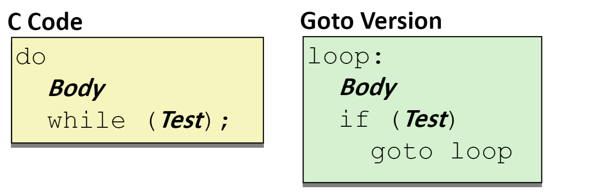
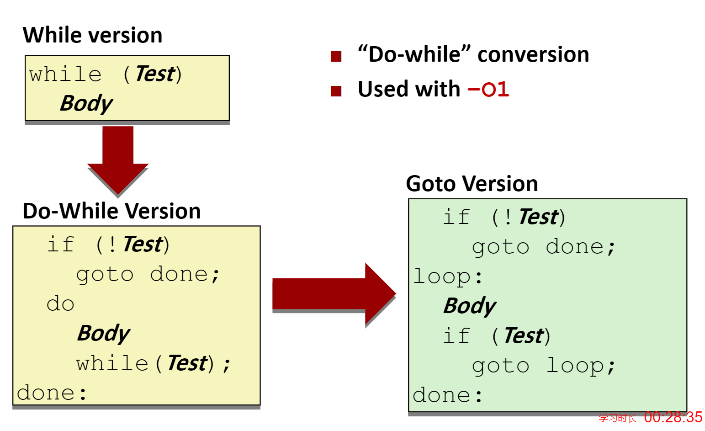
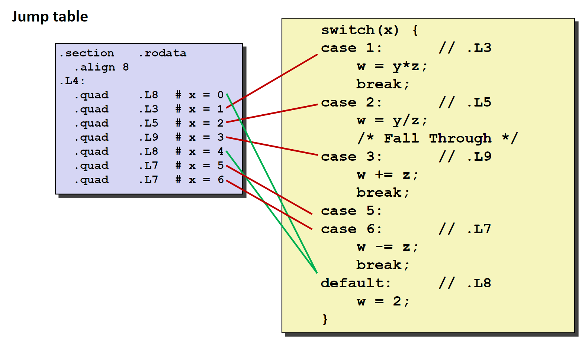

# 程序的机器级表示——控制

在实际的程序执行过程中，代码并不总是从上到下依次执行的，需要根据数据的不同执行不同的语句。这里C语言中表现为流程控制语句，同样的，汇编代码也支持流程控制。我们通过学习C语言的流程控制语句如何在汇编语言中实现来学习汇编语言中的流程控制。

## 条件码

在汇编语言中，我们通过一系列的条件寄存器来判断程序当前执行的状态，还约定一些特定的寄存器来存储程序运行的状态。例如，`%rsp`寄存器标记了当前内存中栈顶的位置，`%rip`指明了当前运行指令的位置。条件寄存器是一系列一位寄存器，这些条件寄存器会被隐式或者显式的设置。

条件寄存器有以下的4个，同时注明了他们被隐式设置的条件：

- `CF`在算术运算的结果使最高位产生了溢出
- `ZF`算术运算的结果为0
- `SF`算术运算的结果为负数
- `OF`符号位产生了溢出

可以通过`CMP`指令和`TEST`指令进行显式的设置。

- `CMP S1, S2`基于`S2 - S1`的值设置条件寄存器
- `TEST S1, S2`基于`S1&S2`的值设置条件寄存器

在实践中，我们往往不会直接去访问这些条件条件寄存器，而是通过一系列的条件执行指令来使用。例如，根据条件码的某种组合，将一个字节设置为0或者1；根据条件码跳转到程序的某个其他部分继续执行；或者有条件的传送数据。

### 条件设置指令

在条件寄存器满足一定条件的基础上，将目的寄存器的最低位为设置为0或者1，下图给出了条件寄存器的使用条件。


例如下面一段C语言程序和其对应的汇编语言程序：

```c
int gt(long x, long y)
{
	return x > y;
}
```

```nasm
cmpq %rsi, %rdi # x in %rdi y in %rsi
setg %al;
movzbl %al, %eax
ret
```

> 在使用`cmp`指令时，需要尤为注意操作数的顺序。

### 条件跳转指令

在条件寄存器满足一定条件时，跳转到程序的其他部分执行。


在汇编代码中，`jump`指令产生的效果类似于C语言中的`goto`语句，具体的使用在下面的流程控制的实现中具体介绍。

### 条件传送指令

在条件寄存器满足某一条件时，将值复制到目的地。条件指令在1996年之后的处理器中添加，现代的C语言编译器会尝试使用这种指令去优化流程控制语句。因为采用条件传送指令可以让现代处理器流水线执行方式的效率更高。而且使用条件传送指令可以避免控制跳转。下面是一个使用条件传送指令的例子：

```c
long absdiff(long x, long y)
{
	long result;
	if (x > y)
		result = x-y;
	else
		result = y-x;
	return result;
}
```

其对应的汇编代码是：

```nasm
absdiff:
    movq %rdi, %rax# x
    subq rsi, %rax# result= x-y
    movq %rsi, %rdx
    subq %rdi, %rdx# eval= y-x
    cmpq %rsi, %rdi# x:y
    cmovle %rdx, %rax# if<=, result= eval
    ret
```

不过使用条件传送指令会存在一些问题。在控制流程比较复杂的时候，条件传送指令会导致多余的运算，因为条件传送指令需要计算每一个分支的运算结果。同时也是由于条件传送指令需要计算每一个分支的运算结果，如果分支中存在一些不安全（例如，访问空指针）或者破坏性的操作（例如：`x++`）就会导致程序出错。

### 分支控制

> 就是C语言中的`if`语句

> 在较新版本的`gcc`编译器中，`if`语句可能已经被条件传送指令优化了，因此我们需要使用`-fno-if-conversion`来告诉`gcc`不进行优化

我们先给出一个例子：

```c
long absdiff(long x, long y)
{
	long result;
	if (x > y)
		result = x-y;
	else
		result = y-x;
	return result;
}
```

```nasm
absdiff:
	cmpx0, x1# x:y
	bgt .L4
	sub    x0, x1,x0#x0=x1-x0
.L1:
	ret
.L4:       # x <= y
	subx0,x0, x1
	b .L1
```

我们可以用C语言中`goto`语句来“仿写”这段汇编代码：

```c
long absdiff_j(long x, long y)
{
	long result;
	intntest= x <= y;
	if (ntest) 
		gotoElse;
	result = x-y;
	gotoDone;
Else:
	result = y-x;
Done:
	return result;
}
```

三元运算符也可以通过上述的方式实现。

> `goto`重写大法在流程控制这里真的很有用

## 循环控制

### Do-While循环

我们先给出一个例子：

```c
long pcount_do(unsigned long x) 
{
    long result = 0;
    do 
    {
    	result += x & 0x1;
    	x >>= 1;
    } while (x);
    return result;
}
```

使用`goto`重写这段代码：

```c
long pcount_goto(unsigned long x) 
{
	long result = 0;
loop:
	result += x & 0x1;
	x >>= 1;
	if(x) gotoloop;
	return result;
}
```

在写成`goto`的版本之后，我们可以容易的写出对应的汇编语言代码。

```nasm
	movl    $0, %eax#  result = 0
.L2:# loop:
	movq %rdi, %rdx
    andl    $1, %edx#  t = x & 0x1
    addq    %rdx, %rax#  result += t
    shrq    %rdi#  x >>= 1
    jne     .L2#  if(x) goto loop
    rep; ret#seebookp141
```

`Do-While`翻译可以总结为以下的过程：



### While循环

有了上面学习`Do-while`的基础，我们直接给出一个`While`的翻译过程：


上面给出的翻译只是`while`语句的一种翻译方式，我们还可以将`while`循环先改写为`do-while`再翻译为汇编代码。



对于`gcc`而言，在使用`-Og`时会使用第一种翻译方式，在使用`-O1`时会使用第二种翻译方式。

### For循环

先将For循环翻译为While循环，再翻译为汇编语言。


## Switch语句

由于switch语句中含有大量的跳转，为了提高跳转的效率，我们引入一个被称为**跳转表**的玩意儿。在跳转表中存储着每一个分支的语句地址，可以将switch的变量当作是这张表的索引，在执行时直接跳转到对应的地址进行执行。

首先给出一段C语言的switch语句如下：

```c
long my_switch(long x, long y, long z)
{
    long w = 1;
    switch(x) 
    {
    case 1:
        w = y*z;
        break;
    case 2:
        w = y/z;
        /* Fall Through */
    case 3:
        w += z;
        break;
    case 5:
    case 6:
        w -= z;
        break;
    default:
    	w = 2;
    }
    return w;
}
```

汇编代码的跳转部分：

```nasm
my_switch:
    movq %rdx, %rcx
    cmpq $6, %rdi   # x:6
    ja .L8
    jmp *.L4(,%rdi,8)
```

在这段汇编代码中，首先通过`cmpq $6, %rdi`处理了`default`的情况，然后通过一个跳转表完成了具体的分支跳转。

> 这种跳转表的使用也被称为间接跳转

以下是跳转表的设计：

```nasm
.section.rodata
	.align 8
.L4:
    .quad.L8# x = 0
    .quad.L3# x = 1
    .quad.L5# x = 2
    .quad.L9# x = 3
    .quad.L8# x = 4
    .quad.L7# x = 5
    .quad.L7# x = 6 
```

跳转表的设计也非常的考究，巧妙的实现了对于`Fall through`和相同分支的处理。


