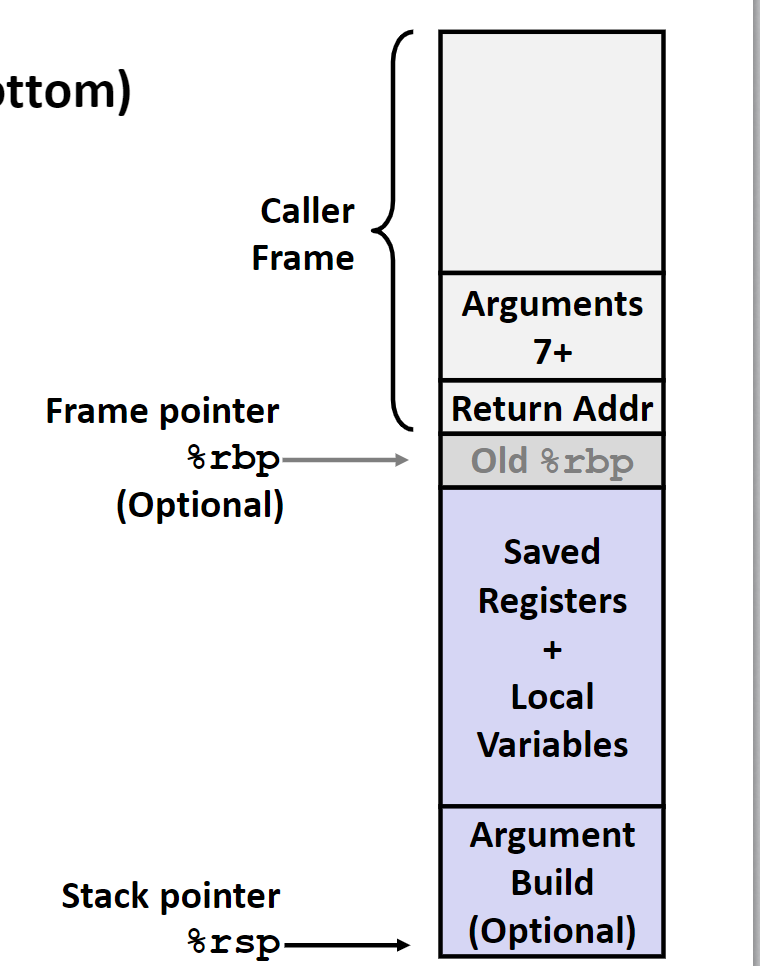

# assembly-procedure

# 程序的机器级表示——过程

我们主要介绍在C语言中函数调用的实现，包括：

- 控制的传送
- 数据的传送
- 内存的管理

> 这些机制的机器级实现完全取决于设计者，这又被称为**ABI**，Application Binary Interface。

## 内存中栈的结构

在内存中存这各种各样的区域，每个区域的管理方式和用途都是不同的。内存中栈：就是内存中按照栈的方式管理的区域。

一般来说，在内存中地址小的一端存放程序的代码，而栈的栈底是内存中地址大的另一端。在程序运行的过程中，栈底按照程序的需求在栈底和代码之间的区域移动。栈顶的地址存储在寄存器`%rsp`中。

在汇编语言中，有着两条专门操作栈的指令：

- `pushq Src`将`Src`的值或者其代表值压入栈中储存
- `popq Dest`将栈顶中的值弹出，存入`Dest`中

## 调用规则

### 控制转移

首先给出一个控制转移的例子：

```c
void multstore(long x, long y, long *dest)
{
	long t = mult2(x, y);
	*dest= t;
}

long mult2(long a, long b)
{
    long s = a * b;
    return s;
}
```

下面是这个函数的汇编代码：

```nasm
0000000000400540 <multstore>:
	400540: push   %rbx# Save %rbx
	400541: mov    %rdx,%rbx# Save dest
	400544: callq  400550 <mult2># mult2(x,y)
	400549: mov    %rax,(%rbx)# Save at dest
	40054c: pop    %rbx# Restore %rbx
	40054d: retq# Return

0000000000400550 <mult2>:
	400550:  mov    %rdi,%rax# a 
	400553:  imul   %rsi,%rax# a * b
	00557:  retq# Return
```

在开始函数时，使用机器指令`callq Addr`来调用对应函数，同时需要将返回的地址，也就是`PC`所存储的值压入栈中存储，在跳转到对应的地址执行。在执行完毕遇到`ret`之后，从栈中取出返回地址，跳转执行。保持当前栈顶所储存的值仍是返回地址是被调用函数的工作，因此如果被调用函数使用了栈，需要将栈还原。

### 数据的传递

对于两条位于不同位置的机器指令来说，他们共享的资源就是那些寄存器，因此在函数调用的过程中，使用寄存器在两个函数之前传递参数。

对于函数的前六个参数，我们约定了六个寄存器来存储他们：

|1|2|3|4|5|6|
| ----| ----| ----| ----| ---| ---|
|%rdi|%rsi|%rdx|%rcx|%r8|%r9|

对于函数的返回值，我们将存放在寄存器`%rax`中。

如果函数有多于六个参数的函数，我们可以通过将参数压入栈中的方式来进行参数的传递。

### 状态管理

对于基于栈的语言来说，比如C语言，每个函数的每个调用过程都应该是**可重入的**。

> 这里有点太抽象了，我的理解来说，就是每个函数的每次调用都会用到一些寄存器和局部变量，为了确保再调用结束之后这些值不变，我们需要在栈上开辟一点空间来存储这些值。

这一段被分配的栈空间就被称作栈帧。在一些情况下，还存在着一个栈帧寄存器`%rbp`，它指向当前栈帧开始的内存地址，这段内存地址中存储的内容是上一段栈帧的起始地址。



在这段栈帧中保存着这些信息：

- 多余6个的函数调用参数
- 在寄存器中的无法存储的局部变量
- 那些值可能被破坏的寄存器值，比如需要使用寄存器`r11`，但是上一个函数也使用了这个寄存器，为了避免寄存器中的值被破环，先把其中的值保存在栈中再使用这个寄存器。

下面给出一个例子：

```c
long call_incr() 
{
    long v1 = 15213;
    long v2 = incr(&v1, 3000);
    return v1+v2;
}
```

```nasm
call_incr:
	subq $16, %rsp
	movq $15213, 8(%rsp)
	movl $3000, %esi
	leaq 8(%rsp), %rdi
	call    incr
	addq 8(%rsp), %rax
	addq $16, %rsp
	ret
```

在函数`call_incr`调用`incr`的过程中，先在栈上开辟了一段空间储存局部变量`v1`的值，再调用函数`incr`。在调用结束之后，将这个值从栈上取出，函数继续。

#### 寄存器保存约定

在函数的调用的过程中，为了保证每个函数使用的寄存器不会被其他的函数改变，将寄存器分为两类：

- 调用者保存寄存器：这些寄存器中的内容应该在调用之前由调用者保存在它自己的栈帧上
- 被调用者保存寄存器：这些寄存器中的内容应该在调用之后由被调用者保存在它自己的栈帧上，当然如果这个寄存器被调用者不用，自然不用保存。

通过这条简单的规则，我们就能确保每个函数使用的寄存器中的值都真是自己的。

用作返回值和调用参数的寄存器是调用者保存的寄存器，毕竟在数据传递的过程中，这些寄存器几乎必然被破坏。其他的寄存器基本都是被调用者保存的寄存器。当然存在几个特殊的寄存器：`%r10`和`%r11`就是调用者保存的寄存器，`%rbp`和`%rsp`是两个特殊的寄存器。
