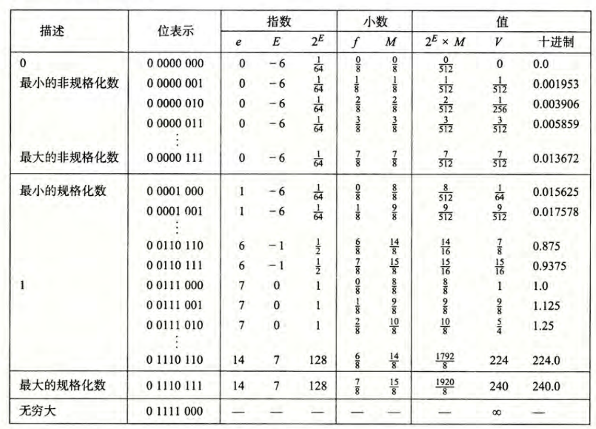

# 数据的位级表示

## 数据的表示

### Bits

- Bits的取值可以为0或者1
- 计算机可以通过Bits判断做什么，Bits还可以代表计算机中的数据
- 在电路中，Bits是通过电压的高低来代表的

### 字节的编码

1 Byte = 8 bits

- 二进制 00000000~11111111
- 十进制0~255
- 十六进制 00~FF

> 在数据的前面加上0x即表示十六进制

### 其他数据类型

在32位和64位构架的计算机上，数据类型的表达可能不一样。

## 位级运算

### 布尔代数

- And 和
- Or 或
- Not 非
- Exclusive Or 异或

可以直接将布尔代数的运算方法运用在bit向量上，也就是一个比特串上的运算。所有布尔代数中的运算特性都可以运用在比特向量上。

> 布尔代数和集合运算上的相似性：
>
> - 与——集合的交集
> - 或——集合的并集
> - 非——集合的补集
> - 异或——对称差（Symmetric difference）

### C语言中的位级运算

&，|，~，^运算符都可以在C语言中使用。

#### 同C语言中逻辑操作的比较

C语言中还提供了一系列的逻辑运算符：&&, ||, !，应注意逻辑运算符和位级运算符之间的区别。

在逻辑运算中，具有以下的特征：

- 将0视为假
- 任何不为0的数据都是真
- 总是返回0或者1
- 在逻辑表达式中，如果前半段的语句即可判断整个语句的真假，则直接返回而不继续执行（Early termination）

### 移位运算

#### 左移

将比特向量向左移位，多余的位直接丢弃，空余的位采用0填充。

#### 右移

将比特向量向右移位，如果是逻辑右移，就在向量的左边填上0，如果是算术移位，就在向量的左边填上符号位，也就是填上最高位。

> 如果移动一个负值或者移动的长度超过了比特向量的长度（字长），那么就是未定义的操作，在不同机器中会表现出不同的行为。

## 整数

### 有符号整数和无符号整数的表示

将一个比特串转换为无符号的整数：
$$
B2U(X) = \sum_{i=0}^{w-1}x_i \times 2^i
$$
将一个比特串转换为有符号的整数：
$$
B2T(X) =- x_{w-1} \times 2^{w-1} + \sum_{i=0}^{w-2}x_i \times 2^i
$$

### 表示范围

对于一个无符号的整数，其最小值是$U_{min} = 0$， 其的最大值是$U_{max} = 2^w - 1$。

对于一个有符号的整数，其最小值是$T_{min} = -2^{w-1}$，其的最大值是$T_{max}=2^{w-1}-1$。

对于一个短整型类型的整数，其的字长是16位：

|           | 16     |
| --------- | ------ |
| $U_{max}$ | 65535  |
| $T_{max}$ | 32767  |
| $U_min$   | -32768 |

我们不难发现，其中存在着：

- $|T_{min}| = T_{max} + 1$
- $U_{max} = 2 \times T_{max} + 1$

- 无符号整数和有符号整数中非负数的位级表示是一致的
- 每一个比特串都只代表着一个唯一的整数，即唯一性，也就是我们可以建立起一对函数将整数转换为比特串

### 类型转换和强制类型转换

在有符号和无符号整数相互转换的过程中，先转换为一个比特串，再重新表示，也就是说再转换的过程中，位级的表示是不会变换的。

在C语言中：

- 在默认情况下，常量均是作为有符号的整数看待的
- 在有符号数和无符号数之间的强制类型转化将按照位级表示不变的方式执行
- 在赋值的过程中发生的隐式类型转换也按照位级表示不变的方式执行
- 在一个有符号和无符号混杂的表达式中，有符号的整数会被先转换为无符号的整数

| 常数         | 常数2           | 结果 | 运算时的类型 |
| ------------ | --------------- | ---- | ------------ |
| 0            | 0U              | ==   | unsigned     |
| -1           | 0               | <    | signed       |
| -1           | 0U              | >    | unsigned     |
| 214748647    | -214748647-1    | >    | signed       |
| 214748647U   | -214748647-1    | <    | unsigned     |
| -1           | -2              | >    | signed       |
| (unsigned)-1 | -2              | >    | unsigned     |
| 214748647    | 214748648U      | <    | unsigned     |
| 214748647    | (int)214748648U | >    | signed       |

总结：类型转换都是保持位级表示不变而重新解释。

### 扩展和截断

将低字长的整数转换为高字长的整数称为扩展，无符号数在前面填0，而有符号数在前面填1。

将高字长的整数转换为低字长的整数称为截断，直接抛弃前面的位就可以了，再对结果进行重新解释。

### 加减乘除

#### 无符号整数的相加

按位相加，将溢出的数位直接忽略。或者用更加数学化的语言：
$$
s = UAdd_w(u,v)=(u+v)mod2^w
$$

#### 有符号整数的相加

与无符号整数的加法在位级表现上是一致的，仍然是按位相加，并且忽略溢出的部分。也就是说，运行下面给一段C代码：

```c
int s, t, u, v;
s = (int) ((unsigned)u + (unsigned)v);
t = u + v;
```

在运行之后的结果是`s == t`。

在有符号整数相加的溢出中，如果结果大于等于$2^{w-1}$，那么发生负溢出，结果是一个负数，如果结果小于$-2^{w-1}$，那么发生正溢出，结果是一个负数。

#### 整数的乘法

存储w位的整数的乘法需要$2^w$位的空间。在实际的计算过程中，仍然是忽略掉所有溢出的数位，在数学上就是：
$$
UMult_w(u,v)=(u \times v)mod2^w
$$
有符号数和无符号上乘法在细节上可能存在一定的差异，但是最后计算结果的低位是一致的。

在实现乘以2的幂时，我们可以通过移位操作来实现，也就是说`u << k`得出的结果就是$u \times 2^k$，这个结论对于无符号整数和有符号整数都是成立的。而且对于现代的处理器来说，移位和加法操作远快于乘法操作，因此在计算乘法时，编译器会尽量优化为移位和加法操作来完成。

在无符号整数除以2的幂时，我们可以采用逻辑右移来实现，也就是说`x >> k`就是$\lfloor u / 2^k \rfloor$。在有符号整数除以2的幂时，我们可以采用算术右移来实现，也即`x >> k`就是$\lfloor u / 2^k \rfloor$，但是当结果是负数时，我们希望计算机能向靠近0的方向舍入，也就是向上舍入。于是我们可以进行修正：$(x + 2^k - 1) / 2^k$，通过加上一个整数来使结果”看上去“像是向上取整的。

#### 求负数

对整数求负数，可以通过`-x = ~x + 1`来实现。但是这个运算存在两个特例，`0`和$T_{min}$，这两个数求负数的结果都是它自己。

## 位与内存，指针和字符串

### 面向字节的内存组织

程序通过**地址**来访问内存，我们可以将内存视为一个超级大的字节数组。同时，对于每一个不同的进程，操作系统都提供了一个独立的内存空间供程序使用。

任何计算机都有一个指定的**字长**，通常这个数值指定了`int`类型和地址的字节长度。现在的大部分计算机都是`64`位的，也就是说这些计算机采用8字节作为字长。现在的计算机大多都是同时支持32位和64位的，这样在32位时代时编写的程序在64位的计算机上也可以正常的运行。

下面的这张表给出在在不同字长的计算机和`x86-64`架构计算机上不同数据类型的典型字长。

| C语言中的类型名称 | 32位典型值 | 64位典型值 | x86-64架构下的大小 |
| ----------------- | ---------- | ---------- | ------------------ |
| char              | 1          | 1          | 1                  |
| short             | 2          | 2          | 2                  |
| int               | 4          | 4          | 4                  |
| long              | 4          | 8          | 8                  |
| float             | 4          | 4          | 4                  |
| double            | 8          | 8          | 8                  |
| pointer           | 4          | 8          | 8                  |

### 字节顺序

在内存中储存数据时，显然不可能所有的数据都只占据一个字长的空间。当数据占用了多个字长的空间时，字节的顺序就显得尤为重要。

字节的顺序存在着下面两种情况：

- 大端法
- 小端法

需要指出的是，大端法和小端法并没有任何性能或者其他方面的差异，仅是计算机设计者在设计时的偏好。

> 就像是从大头打破鸡蛋还是从小头打破鸡蛋，这是《格列佛游记》中的一个故事，大端法和小端法的英文名称也是来自于这个典故。

我们可以编写一个C函数来打印一个数据的每个字节：

```C
typedef unsigned char* pointer;
void show_bytes(pointer start, size_tlen)
{
    size_t i;
    for (i= 0; i< len; i++)
        printf(”%p\t0x%.2x\n",start+i, start[i]);
    printf("\n");
}

```

### 字符串的表示

在C语言中，字符串的表示都是一个字符的数组，每个字符都通过`ASCII`的方式进行编码。通过每一个字符串都需要是空终止的，也就是说最后一个字符是0。

> 这里的0不是字符'0'，而是数值0

## 浮点数的表示

### 分数的位级表示

仍然采用一种加权的思想，给每一个二进制位赋予一个权重，对于小数点右边的位数，我们将它们赋给2的负数次方幂的权值。在这种表示方法下，我们可以表示这样的有理数：
$$
\sum_{k = -j}^{i}b_K \times 2^k
$$
给出一个例子：

| 值    | 表示       |                                         |
| ----- | ---------- | --------------------------------------- |
| 5.75  | $101.11_2$ | $4+1+\frac{1}{2}+\frac{1}{4}$           |
| 2.875 | $10.111_2$ | $2+\frac{1}{2}+\frac{1}{4}+\frac{1}{8}$ |

但是这种表示方式具有一定的缺陷：

- 只有符合$\frac{x}{2^k}$公式的数值可以被精准的表示，其他的分数会被表示为无限循环小数。
- 小数点的位置时固定的，在表示特别大和特别小的数上时十分困难

### IEEE浮点数标准

#### IEEE 754标准

这个标准具有许多的优点：

- 这个1985年确定的标准几乎被大多数的CPU所支持
- 在处理涉入、上溢和下溢上十分的巧妙

#### 浮点数的表示

这个标准通过这样一个数学公式表示小数：
$$
(-1)^s M 2^E
$$

- 符号位`s`确定这个浮点数是正数还是负数
- 位数`M`表示一个位于`[1.0,2.0)`之间的小数
- 阶码`E`表示一个2的一个幂

在计算机中，使用`MSB`准确编码符号位，使用`frac`近似编码位数，使用`exp`近似编码阶码。一般有着两种不同的字长来编码浮点数，长度分别为32位和64位，分别被称为单精度浮点数和双精度浮点数。


在编码的长度指定之后，通过`exp`值的不同，被编码的值可以被分为三种不同的情况：

- `exp`每一位上都是0，称为非规格化的编码。此时上述数学公式中的`E`为$1-bias$，这个`bias`是一个偏置值，这个偏置值和`exp`的位数有关，如果`exp`有着`k`位，那么$bias = 2^{k-1}-1$。
  - 如果`frac`全为0，通过符号位的不同，我们就可以得到两个`0`，`+0`和`-0`
  - 如果`frac`不全为0，我们可以表示那些十分接近于`0`的值

- `exp`中既有1又有0，称为规格化的编码。此时`exp`的值等于上述数学公式中的阶码加上偏置值`E+bias`。

  例如现在有一个小数`15213.0`，则有$15213_{10}=11101101101101_2=1.1101101101101_2 \times 2^{13}$，于是表示这个数的浮点数的`frac`部分是`11011011011010000000000`，`exp`部分就是$13 + 2^7 - 1 = 13 + 127 = 140 = 10001100_2$，于是这个数的浮点形式就是：

  

- `exp`中全部都是1，称为特殊编码。这种编码方式下还有这两种不同形式：
  - 当`frac`全为0时，表示无穷大或者无穷下
  - 当`frac`不全为0时，表示`NaN`，即不是一个数，这个值常出现在一些非法操作的结果中。

> 在设计时，将规格化和非规格化分开的目的是从非规格化的数转化为规格化数时，位级表示是平滑的（抽象拉满）。具体如何平滑见下图：
>
> 

### C语言中的浮点数

C语言中实现了两种字长的浮点数，4字节的`float`和8字节的`double`。

C语言中`float`，`double`和`int`之间的类型转换比较复杂，介绍如下：

- 在这三个类型之间相互转换回改变位级表示

- `double/float `转换为`int`：

  - 分数的部分会被直接忽略
  - 会向趋近于0的方向圆整
  - 如果是发生了溢出或者`NaN`，一般是转换为$T_{Min}$

- `int`转换为`double`

  - 准确的转换

- `int`转换为`float`

  - 将按照指定的舍入模式舍入

  > 具体是个啥模式没说

为了帮助理解，给出下列例子：

| 布尔表达式               | 正误 |
| ------------------------ | ---- |
| `x == (int)(float)x`     | 错误 |
| `x == (int)(double)x`    | 正确 |
| `f == (float)(double)f`  | 正确 |
| `d==(double)(float)d`    | 错误 |
| `f == -(-f)`             | 正确 |
| `2/3==2/3.0`             | 错误 |
| `d < 0.0 -> (d*2) < 0.0` | 正确 |
| `d > f -> -f > -d`       | 正确 |
| `d * d >= 0.0`           | 正确 |
| `(d + f)-d==f`           | 错误 |

