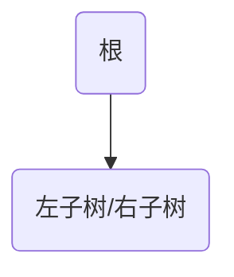
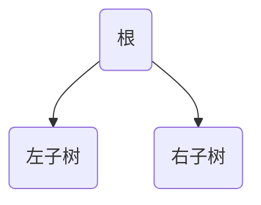
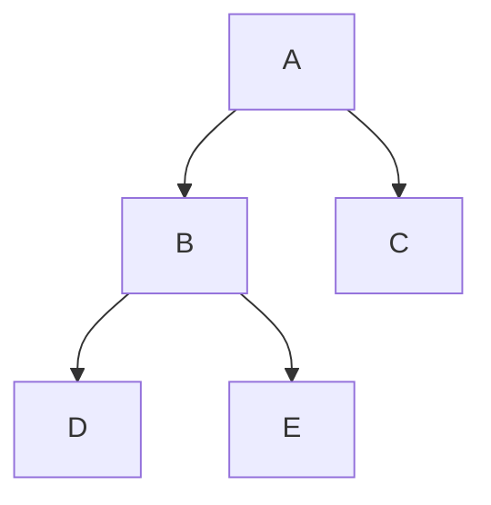
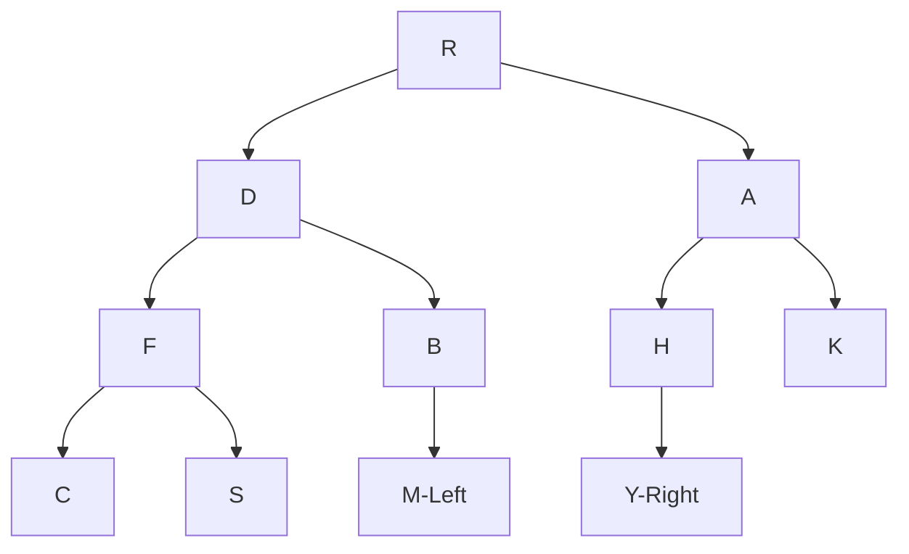
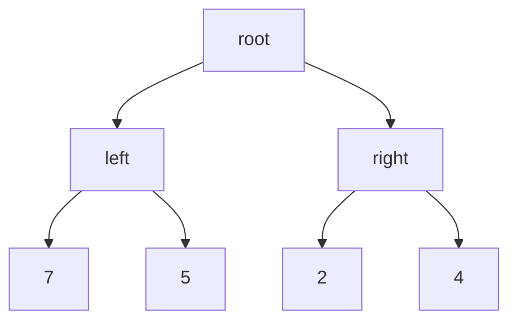
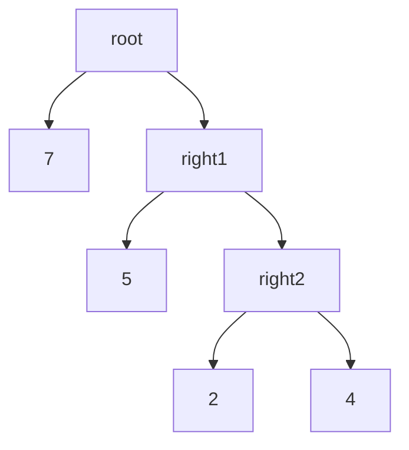

# 树

## 树的结构定义和基本操作

### 树的定义

树是一类重要的非线性数据结构，是以分支关系定义的层次结构。

树是由若干个节点组成的有限集合。

### 树的基本术语

- 节点的度：节点拥有的子树数目
- 叶子（终端）节点：度为0的节点
- 分支节点：度不为0的节点
- 树的度：树的各节点度的最大值
- 内部节点：除根节点以外的节点
- 子节点和父节点：节点的子树的根是该节点的孩子，该节点为父节点
- 兄弟：具有同一父节点的子节点互为兄弟
- 节点的祖先：从根到该节点所经分支上的所有节点
- 节点的子孙：该节点为根的子树中的任一节点
- 节点的层次：表示该节点在树中的相对位置
- 堂兄弟：父节点在同一层的节点互为堂兄弟
- 树的深度：树中节点的最大层次
- 有序树：树中各节点的子树从左至右是有次序的，不能互换。如果反之则为无序树
- 路径长度：从树中的某节点出发，能够”自上而下的“通过树中节点到达另外一个节点，就称这两个节点之间存在一条路径，路径经过的分支数称为路径长度
- 树的路径长度：从根到每个节点的路径长度之和
- 森林：许多互不相交的树的集合

### 树的基本操作

- 初始化操作
- 求根操作
- 求父节点操作
- 求子节点操作
- 求兄弟操作
- 建树操作
- 插入子树操作
- 删除子树操作
- 遍历操作
- 清除结构操作

## 二叉树

### 二叉树的定义

二叉树是n个结点的有限集合，或者为空树，或由一个根节点和两颗互不相交的左子树和右子树的二叉树组成。

二叉树的特点：

- 定义是一个递归的定义
- 结点的度总是大于等于0小于等于2的
- 是有序树

二叉树作为一种有序树，在使用中需要区别左子树和右子树；即使只有一颗子树也需要指明这是左子树还是右子树。总的来说，二叉树总共有着五种基本的形态：空表

根和空的左右子树


根和左子树或者右子树，这是两种不同的树



根和左右子树



二叉树还存在一些其他的概念：

- 满二叉树：一颗深度为`k`且有$2^k-1$个结点的二叉树称为满二叉树
- 完全二叉树：若一颗二叉树至多只有最下面的两层上结点的度数可以小于2，并且最下面一层上的结点都集中在该层最左边的若干位置上，则此二叉树可以被称为完全二叉树

### 二叉树的性质

- 二叉树的第`i`层上至多有$2^{i-1}$个节点
- 深度为`k`的二叉树至多有$2^k-1$个节点
- 对于任何一棵二叉树T，如果其终端节点数为$n_0$，度为2的节点数为$n_2$，则有$n_0=n_2+1$

  证明：除了树中的根节点，每一个结点都有一个进入的分支，所以进入结点的分支数$n_0+n_1+n_2-1$，而离开结点的分支数为$n_1+2 \times n_2$，由于分支数是守恒的，所以可以得到$n_0=n_2+1$
- 具有n个结点的完全二叉树的深度为$\lfloor log_2n\rfloor+1$

  证明：假设树的深度为k，则有节点数$2^{k-1}-1 &lt; n \le 2^k-1$，进行适度的放缩$2^{k-1} \le n &lt; 2^k$，然后在对左边的不等式两边取对数，再由n必然是整数，可以得到$k=\lfloor log_2n\rfloor+1$
- 对于一颗具有n个结点的完全二叉树从上到下从左至右进行1至n的编号，则对于任何一个结点i($1 \le i \le n$)，有如下的三条结论：

  - 如果$i &gt; 1$,则结点的父节点是$\lfloor \frac{i}{2}\rfloor$
  - 如果$2i \le n$,则i的左子节点是$2i$
  - 如果$2i+1\le n$，则i的右子节点是$2i+1$

### 二叉树的基本操作

- 初始化操作
- 求根函数
- 求父节点函数
- 求子节点函数
- 求兄弟结点函数
- 建树操作
- 插入子树操作
- 删除子树操作
- 遍历操作
- 清楚结构操作

### 二叉树的储存结构

#### 顺序存储

利用二叉树的第五个性质，将树从上到下从左至右地将树存储到一个数组当中，如果一个结点并不存在，也要在数组中占据一个位置。但是这样存储不算是很好的，如果树中空余的元素比较多，那么空间的利用率就会很低，而且如果树发生变化，修改这个数组是比较复杂的，也就是灵活性不咋样。

> 所以在实际中很少用到顺序存储来存二叉树

#### 链式存储

在链式存储的设计上有着两种方式：

- 二叉链表：含有左子节点、数据部分和右子节点
- 三叉链表/带父节点的二叉链表：在二叉链表的基础上增加了指向父节点的指针

在具体使用需要按照实际情况下选择合适的结构体定义，在一般情况下我们都使用二叉链表。

### 二叉树的基本操作

结构体定义如下：

```cpp
struct tree {
    int data;
    struct tree* l_child;
    struct tree* r_child;
};

typedef struct tree tree_t;
typedef struct tree* tree_p;
```

#### 二叉树的创建

#### 二叉树的遍历

在二叉树的应用中，遍历操作是十分普遍的，但是二叉树是一个非线性的结构，想要设计一个线性的队列将整个树每一个结点不重不漏的都遍历一遍是比较困难的，于是我们采用递归的方法。

由于树的递归定义，一棵树又左节点，根节点和右节点组成，因此在遍历时就存在三种遍历的顺序，我们按照遍历根的顺序吧他们称为前序、中序和后序。我们以下面这棵树给出三种遍历的顺序：



前序遍历：ABDEC

中序遍历：DBEAC

后序遍历：DEBCA

看完上面一个比较简单的例子，我们给出一个比较复杂的例子：



前序遍历：RDFCSBMAHYK

中序遍历：CFSDMBRHYAK

后序遍历：CSFMBDYHKAR

利用前序+中序或者中序+后序我们可以从遍历的顺序中回复出原有的二叉树结构。

##### 前序遍历的实现

```cpp
void preorder_iter(tree_p t)
{
    if (t != nullptr)
    {
        // do something
        Preorder(t->l_child);
        Preorder(t->r_child);
    }
}
```

不过由于在树中叶子结点占大多数，采用如上的递归算法会存在许多的无效递归调用，我们可以如下优化：

```cpp
void preorder_iter_2(tree_p t)
{
    // do something
    if (t->l_child == nullptr)
    {
        preorder_iter_2(t->l_child);
    }
    if (t->r_child == nullptr)
    {
        preorder_iter_2(t->r_child);
    }
}
```

或者，由于对于右节点的递归实质上是一个伪递归，我们可以用一个循环来替代这个递归

```cpp
void preorder_iter_3(tree_p t)
{
    while (t != nullptr)
    {
        // do something
        preorder_iter_3(t->l_child);
        t = t->r_child;
    }
}
```

当然，我们可以用栈来模拟递归，将递归的调用完全消除

```cpp
void preorder_iter_4(tree_p t)
{
	stack_t s;
    init_stack(s);
    tree_p node = t;
    while(node != nullptr)
    {
        // do something
       	if (node->r_child != nullptr)
        {
            stack_push(s,node->r_child);
        }
        if (node->l_child != nullptr)
        {
            node = node->l_child;
        }
        else
        {
            node = stack_pop(s);
        }
    }
}
```

##### 中序遍历的实现

```cpp
void inorder_iter(tree_p t)
{
	if(t != nullptr)
	{
		inoder_iter(t->l_child);
		// do something
		inorder_iter(t->r_child);
	}
}
```

##### 后序遍历算法

```cpp
void postorder_iter(tree_p t)
{
    if(t != nullptr)
    {
        postorder_iter(t);
        postorder_iter(t);
        // do something
    }
}
```

在实现遍历算法之后，我们可以利用遍历操作来实现查找指定节点值的节点、求节点所在层次、求二叉树的深度，二叉树的复制等等一系列操作。

## 线索二叉树

上面已经说明了，遍历二叉树实际上就是将二叉树中的节点排成一个线性的队列。在有些时候，我们不希望对二叉树完全进行遍历就能找到指定节点的前驱和后继，在这种情况下，我们就需要记录每个节点的前驱和后继，这样的二叉树就是线索二叉树。

线索二叉树最简单的实现方式就是按照定义，在节点的定义中添加一个前驱指针和一个后继指针，但是这样会使空间的利用率大大降低。

为了提高一下空间的利用率，我们可以注意到在原有的$n$个节点的二叉树中，还有$n+1$个指针域的内容是空指针，我们不妨利用一下这些空指针来储存我们的前驱和后继。

### 线索二叉树的存储结构

```cpp
typedef enum
{
    child;
    node;
} pointer_type_t;

struct clue_tree 
{
	pointer_type_t l_tag;
    int* l_child;
    int data;
    int* r_child;
    pointer_type_t r_tag;
}
```

在实际的操作过程中，前序和后序线索二叉树在寻找后继或者前驱时仍然存在麻烦，我们一般只使用中序线索二叉树。

对于中序线索二叉树：

- 在寻找前驱时，如果`l_tag`是`child`，那么从其左子沿着右链走到`r_tag`是`node`的节点即为前驱，如果`l_tag`是`node`，那么就是前驱。
- 在寻找后继时，如果`r_tag`是`child`，那么从其右子沿着左链走到`l_tag`是`node`的节点即为后继，如果`r_tag`是`node`，那么就是后继。

### 二叉树的线索化

利用中序遍历算法：

- 遍历左子树
- 访问当前节点
  - 首先判断`l_tag`和`r_tag`的值
  - 建立前驱的后继线索
  - 建立前驱
  - 将当前节点作为下一个节点的前驱
- 遍历右子树

## 哈夫曼树

### 哈夫曼树的概念

在正式介绍哈夫曼树之前，我们先介绍一组术语：

- 节点权值：有某种意义的实际数字
- 节点的路径长度：从根节点到每一个节点的路径上的分支数
- 带权路径长度：节点的路径长度与该节点的权之积
- 树的带权路径长度：树中所有叶子节点的带权路径长度之和

  这个值记为：

  $$
  wpl = \sum_{k=1}^{n}w_kl_k
  $$

  在公式中，$w_K$为节点的权值，$l_k$为节点到根的路径长度。
- 最优二叉树：带权路径长度最小的二叉树。这种树也被称为哈夫曼树。

我们在给出一个例子：现在有着4个节点，节点的权值分别为7，5，2，4，请构造一个具有四个叶子节点的二叉树。

我们先给出一个“均匀”的例子：



这颗二叉树的WPL值为36

我们在给出一个比较优化的二叉树：



### 哈夫曼树的建立方法

建立哈夫曼树的基本思想就是使权值大的节点靠近根。

- 将给定的权值从小到大排序为$\{w_1,w_2,\cdots, w_m\}$，生成一个森林$F=\{T_1,T_2,\cdots,T_m\}$，其中每一颗树的根节点的带着对应的权值，左右子树均为空。
- 将F中根的权值最小的两颗二叉树合并成一颗新的二叉树，将新的二叉树加入森林中，同时删除已经合并了两颗二叉树。
- 重复上一步，指导在森林中只剩下一颗树，这棵树就是哈夫曼树。

### 哈夫曼树的存储结构

由于在哈夫曼树中没有度为1的节点，属于是严格二叉树，对于一个有$n$个叶子节点的哈夫曼树来说，这棵树有着$2n-1$个节点。我们可以直接使用一个大小为$2n-1$的向量来储存哈夫曼树。

```cpp
typedef struct {
    // 节点的权值
    unsigned int weight;
    // 节点的父节点和左右子节点在数组中的索引
    unsigned int parent, lChild, rChild;
} HuffmanNode;

typedef HuffmanNode HuffmanNodeP;
```

### 哈夫曼树的应用

#### 哈夫曼编码

为了在通信和数据传送中使总传输的数据量最小，在将信息编码为二进制代码的时候可以使用不等长的编码，对于使用频率比较高的字符使用比较短的编码，对于使用频率比较低的字符使用比较长的编码，这样可以有效压缩编码之后数据的长度。

例如现在有字符集$D=\{t,i,m,e,r,s,u,h\}$，我们要编码的信息为$time tries truth$。

首先写出节点的权值，也就是这里字符出现的频率：

|t|i|m|e|r|s|u|h|
| -| -| -| -| -| -| -| -|
|4|2|1|2|2|1|1|1|

建立哈夫曼树，在左子树视作0，右子树视作1，从叶子节点到根节点就可以写出一种不等长的编码。

|字符|二进制编码|
| ----| ----------|
|t|01|
|i|100|
|m|1110|
|e|101|
|r|110|
|s|1111|
|u|000|
|h|001|

而且在哈夫曼编码中我们不难发现，没有编码是其他编码的前缀，我们不用担心编码之后的结果会引起歧义的问题，所以哈夫曼编码是一种十分不错的编码。

## 树

### 树和二叉树

> 树与二叉树之间的转换：
>
> 在树或者森林同二叉树之间存在一个一一对应的关系。任何一棵树或者森林都能唯一的对应到一颗二叉树，任何一颗二叉树也是唯一对应到一个树或者森林。

在树同二叉树之间的转换方法：

- 树到二叉树：

  - 在所有的兄弟节点之间加一条连线
  - 对于每个节点，除了保留同父节点之间的连线之外，去掉该节点同其他所有节点的连线
  - 所得的树就是一颗二叉树。

  
- 二叉树到树：

  - 将左子节点的右子节点、右子节点的右子节点，……同父节点连接在一起
  - 最后去掉父节点同右子节点的所有连线。

### 树的遍历

我们可以直接对转换生成的二叉树进行遍历，对于二叉树的先序遍历就是树的先序遍历，对于二叉树的中序遍历就是对树的后序遍历，树没有中序遍历。

如果是森林生成的二叉树，我们先定义对于森立的遍历方法。森林的先序遍历就是：访问第一颗树的根节点，先序遍历第一颗树的根的子树森林，先序遍历除第一颗树之外的森林。森林的中序遍历就是：中序遍历第一棵树的根的子树森林，访问第一棵树的根节点，中序遍历除第一颗树外剩余的树构成的森林。对于二叉树的先序遍历对应树的先序遍历，对于二叉树的中序遍历对于树的中序遍历。

### 树的存储结构

我们可以利用二叉树和树之间的关系，采用二叉链表来存储一颗树。

不过采用这种方式保存的树查找指定节点的子节点比较困难，左子节点就是左子节点，而右子节点需要遍历到右子节点链的末尾。

## 树的二叉树的应用举例

### 四皇后问题

#### 问题描述

在4x4的棋盘上放置4个棋子，使得任何两个棋子都不在同一行/列/对角线上，请列出所有合法的布局。

#### 算法

> 采用回溯的算法，在约束的条件下进行先序遍历，并在遍历的过程中剪去那些不满足条件的分支。


