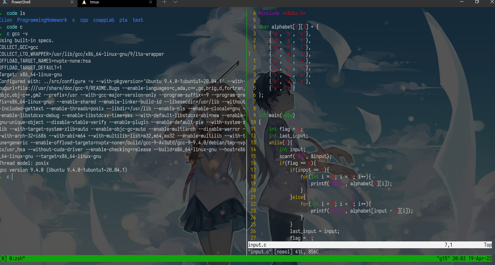

# The Missing Semester in the CS

## Introduction

本篇是MIT的公开课程[计算机教学中消失的一学期](https://missing.csail.mit.edu/)的学习笔记第五篇。在笔记中，我将摘抄我认为是重点的语句，文中举出的例子我会在自己的电脑上操作一遍并给出其产生的结果。

本篇是`Command line environment`部分的学习笔记，课程地址为[Command-ling](https://missing.csail.mit.edu/2020/command-line/)

<!--more-->

## Job Control

### Killing a process

Shell is using a UNIX communication mechanism called a *signal* to communicate information to the process. When a process receives a signal it stops its execution, deals with the signal and potentially changes the flow of execution based on the information that the signal delivered. For this reason, signals are *software interrupts*.

When typing `Ctrl-C` this prompts the shell to deliver a `SIGINT` signal to the process.

Here’s a minimal example of a Python program that captures `SIGINT` and ignores it, no longer stopping. To kill this program we can now use the `SIGQUIT` signal instead, by typing `Ctrl-\`.

```python
#!/usr/bin/env python
import signal, time

def handler(signum, time):
    print("\nI got a SIGINT, but I am not stopping")

signal.signal(signal.SIGINT, handler)
i = 0
while True:
    time.sleep(.1)
    print("\r{}".format(i), end="")
    i += 1
```

When running on my laptop:

```bash
➜  tmp python shell.py
14^C
I got a SIGINT, but I am not stopping
32^C
I got a SIGINT, but I am not stopping
47^\[1]    89 quit       python3 shell.py
```

While `SIGINT` and `SIGQUIT` are both usually associated with terminal related requests, a more generic signal for asking a process to exit gracefully is the `SIGTERM` signal. To send this signal we can use the [`kill`](https://www.man7.org/linux/man-pages/man1/kill.1.html) command, with the syntax `kill -TERM <PID>`.

### Pausing and backgrounding process

Signals can do other things beyond killing a process. For instance, `SIGSTOP` pauses a process. In the terminal, typing `Ctrl-Z` will prompt the shell to send a `SIGTSTP` signal, short for Terminal Stop (i.e. the terminal’s version of `SIGSTOP`).

We can then continue the paused job in the foreground or in the background using [`fg`](https://www.man7.org/linux/man-pages/man1/fg.1p.html) or [`bg`](http://man7.org/linux/man-pages/man1/bg.1p.html), respectively.

The [`jobs`](https://www.man7.org/linux/man-pages/man1/jobs.1p.html) command lists the unfinished jobs associated with the current terminal session. You can refer to those jobs using their pid (you can use [`pgrep`](https://www.man7.org/linux/man-pages/man1/pgrep.1.html) to find that out). More intuitively, you can also refer to a process using the percent symbol followed by its job number (displayed by `jobs`). To refer to the last backgrounded job you can use the `$!` special parameter.

One more thing to know is that the `&` suffix in a command will run the command in the background, giving you the prompt back, although it will still use the shell’s STDOUT which can be annoying (use shell redirections in that case).

To background an already running program you can do `Ctrl-Z` followed by `bg`. Note that backgrounded processes are still children processes of your terminal and will die if you close the terminal (this will send yet another signal, `SIGHUP`). To prevent that from happening you can run the program with [`nohup`](https://www.man7.org/linux/man-pages/man1/nohup.1.html) (a wrapper to ignore `SIGHUP`), or use `disown` if the process has already been started. Alternatively, you can use a terminal multiplexer as we will see in the next section.

```bash
➜  tmp sleep 1000
^Z
[1]  + 95 suspended  sleep 1000
➜  tmp nohup sleep 2000 &
[2] 98
➜  tmp nohup: ignoring input and appending output to 'nohup.out'
jobs
[1]  + suspended  sleep 1000
[2]  - running    nohup sleep 2000
➜  tmp bg %1
[1]  - 95 continued  sleep 1000
➜  tmp jobs
[1]  - running    sleep 1000
[2]  + running    nohup sleep 2000
➜  tmp kill -STOP %1
[1]  + 95 suspended (signal)  sleep 1000
➜  tmp jobs
[1]  + suspended (signal)  sleep 1000
[2]  - running    nohup sleep 2000
➜  tmp kill -SIGHUP %1
[1]  + 95 hangup     sleep 1000
➜  tmp jobs
[2]  + running    nohup sleep 2000
➜  tmp kill %2
[2]  + 98 terminated  nohup sleep 2000
➜  tmp jobs
➜  tmp
```

A special signal is `SIGKILL` since it cannot be captured by the process and it will always terminate it immediately. However, it can have bad side effects such as leaving orphaned children processes.

> orphaned 孤儿的;

You can learn more about these and other signals [here](https://en.wikipedia.org/wiki/Signal_(IPC)) or typing [`man signal`](https://www.man7.org/linux/man-pages/man7/signal.7.html) or `kill -l`.

## Terminal Multiplexers

Terminal multiplexers like [`tmux`](https://www.man7.org/linux/man-pages/man1/tmux.1.html) allow you to multiplex terminal windows using panes and tabs so you can interact with multiple shell sessions. Moreover, terminal multiplexers let you detach a current terminal session and reattach at some point later in time. This can make your workflow much better when working with remote machines since it avoids the need to use `nohup` and similar tricks.

`tmux` expects you to know its keybindings, and they all have the form `<C-b> x` where that means (1) press `Ctrl+b`, (2) release `Ctrl+b`, and then (3) press `x`.

`tmux` has the following hierarchy of objects:

> hierarchy 等级制度;

- Sessions

  \- a session is an independent workspace with one or more windows

  - `tmux` starts a new session.
  - `tmux new -s NAME` starts it with that name.
  - `tmux ls` lists the current sessions
  - Within `tmux` typing `<C-b> d` detaches the current session
  - `tmux a` attaches the last session. You can use `-t` flag to specify which

- Windows

  \- Equivalent to tabs in editors or browsers, they are visually separate parts of the same session

  - `<C-b> c` Creates a new window. To close it you can just terminate the shells doing `<C-d>`
  - `<C-b> N` Go to the *N* th window. Note they are numbered
  - `<C-b> p` Goes to the previous window
  - `<C-b> n` Goes to the next window
  - `<C-b> ,` Rename the current window
  - `<C-b> w` List current windows

- Panes

  \- Like vim splits, panes let you have multiple shells in the same visual display.

  - `<C-b> "` Split the current pane horizontally
  - `<C-b> %` Split the current pane vertically
  - `<C-b> <direction>` Move to the pane in the specified *direction*. Direction here means arrow keys.
  - `<C-b> z` Toggle zoom for the current pane
  - `<C-b> [` Start scrollback. You can then press `<space>` to start a selection and `<enter>` to copy that selection.
  - `<C-b> <space>` Cycle through pane arrangements.



## Alias

It can become tiresome typing long commands that involve many flags or verbose options. For this reason, most shells support *aliasing*. A shell alias is a short form for another command that your shell will replace automatically for you. For instance, an alias in bash has the following structure:

```bash
alias alias_name="command_to_alias arg1 arg2"
```

Note that there is no space around the equal sign `=`, because [`alias`](https://www.man7.org/linux/man-pages/man1/alias.1p.html) is a shell command that takes a single argument.

```bash
# Make shorthands for common flags
alias ll="ls -lh"

# Save a lot of typing for common commands
alias gs="git status"
alias gc="git commit"
alias v="vim"

# Save you from mistyping
alias sl=ls

# Overwrite existing commands for better defaults
alias mv="mv -i"           # -i prompts before overwrite
alias mkdir="mkdir -p"     # -p make parent dirs as needed
alias df="df -h"           # -h prints human readable format

# Alias can be composed
alias la="ls -A"
alias lla="la -l"

# To ignore an alias run it prepended with \
\ls
# Or disable an alias altogether with unalias
unalias la

# To get an alias definition just call it with alias
alias ll
# Will print ll='ls -lh'
```

## Dotfiles

Many programs are configured using plain-text files known as *dotfiles* (because the file names begin with a `.`, e.g. `~/.vimrc`, so that they are hidden in the directory listing `ls` by default).

Shells are one example of programs configured with such files. On startup, your shell will read many files to load its configuration. Depending on the shell, whether you are starting a login and/or interactive the entire process can be quite complex. For `bash`, editing your `.bashrc` or `.bash_profile` will work in most systems. Here you can include commands that you want to run on startup, like the alias we just described or modifications to your `PATH` environment variable.

Some other examples of tools that can be configured through dotfiles are:

- `bash` - `~/.bashrc`, `~/.bash_profile`
- `git` - `~/.gitconfig`
- `vim` - `~/.vimrc` and the `~/.vim` folder
- `ssh` - `~/.ssh/config`
- `tmux` - `~/.tmux.conf`

How should you organize your dotfiles? They should be in their own folder, under version control, and **symlinked** into place using a script. This has the benefits of:

- **Easy installation**: if you log in to a new machine, applying your customizations will only take a minute.
- **Portability**: your tools will work the same way everywhere.
- **Synchronization**: you can update your dotfiles anywhere and keep them all in sync.
- **Change tracking**: you’re probably going to be maintaining your dotfiles for your entire programming career, and version history is nice to have for long-lived projects.

### Portability

A common pain with dotfiles is that the configurations might not work when working with several machines, e.g. if they have different operating systems or shells. Sometimes you also want some configuration to be applied only in a given machine.

There are some tricks for making this easier. If the configuration file supports it, use the equivalent of if-statements to apply machine specific customizations. For example, your shell could have something like:

```bash
if [[ "$(uname)" == "Linux" ]]; then {do_something}; fi

# Check before using shell-specific features
if [[ "$SHELL" == "zsh" ]]; then {do_something}; fi

# You can also make it machine-specific
if [[ "$(hostname)" == "myServer" ]]; then {do_something}; fi
```

> 显然Windows用户就没戏了，`uname`这个指令在Windows下就没有。

If the configuration file supports it, make use of includes. For example, a `~/.gitconfig` can have a setting:

```bash
[include]
    path = ~/.gitconfig_local
```

And then on each machine, `~/.gitconfig_local` can contain machine-specific settings. You could even track these in a separate repository for machine-specific settings.

This idea is also useful if you want different programs to share some configurations. For instance, if you want both `bash` and `zsh` to share the same set of aliases you can write them under `.aliases` and have the following block in both:

```bash
# Test if ~/.aliases exists and source it
if [ -f ~/.aliases]; then
	source ~/.aliases
fi
```

## Remote Machine

To `ssh` into a server you execute a command as follows

```bash
ssh foo@bar.mit.edu
```

Here we are trying to ssh as user `foo` in server `bar.mit.edu`. The server can be specified with a URL (like `bar.mit.edu`) or an IP (something like `foobar@192.168.1.42`).

### Executing commands

An often overlooked feature of `ssh` is the ability to run commands directly. `ssh foobar@server ls` will execute `ls` in the home folder of foobar. It works with pipes, so `ssh foobar@server ls | grep PATTERN` will grep locally the remote output of `ls` and `ls | ssh foobar@server grep PATTERN` will grep remotely the local output of `ls`.

### SSH Keys

Key-based authentication exploits public-key cryptography to prove to the server that the client owns the secret private key without revealing the key. This way you do not need to reenter your password every time. Nevertheless, the private key (often `~/.ssh/id_rsa` and more recently `~/.ssh/id_ed25519`) is effectively your password, so treat it like so.

#### Key generating

To generate a pair you can run [`ssh-keygen`](https://www.man7.org/linux/man-pages/man1/ssh-keygen.1.html).

```bash
ssh-keygen -o -a 100 -t ed25519 -f ~/.ssh/id_ed25519
```

You should choose a passphrase, to avoid someone who gets hold of your private key to access authorized servers. Use [`ssh-agent`](https://www.man7.org/linux/man-pages/man1/ssh-agent.1.html) or [`gpg-agent`](https://linux.die.net/man/1/gpg-agent) so you do not have to type your passphrase every time.

If you have ever configured pushing to GitHub using SSH keys, then you have probably done the steps outlined [here](https://help.github.com/articles/connecting-to-github-with-ssh/) and have a valid key pair already. To check if you have a passphrase and validate it you can run `ssh-keygen -y -f /path/to/key`.

#### key based authentication

`ssh` will look into `.ssh/authorized_keys` to determine which clients it should let in. 

```bash
ssh-copy-id -i .ssh/id_ed25519 foobar@remote
```

### Copying files over SSH

There are many ways to copy files over ssh:

- `ssh+tee`, the simplest is to use `ssh` command execution and STDIN input by doing `cat localfile | ssh remote_server tee serverfile`. Recall that [`tee`](https://www.man7.org/linux/man-pages/man1/tee.1.html) writes the output from STDIN into a file.
- [`scp`](https://www.man7.org/linux/man-pages/man1/scp.1.html) when copying large amounts of files/directories, the secure copy `scp` command is more convenient since it can easily recurse over paths. The syntax is `scp path/to/local_file remote_host:path/to/remote_file`
- [`rsync`](https://www.man7.org/linux/man-pages/man1/rsync.1.html) improves upon `scp` by detecting identical files in local and remote, and preventing copying them again. It also provides more fine grained control over symlinks, permissions and has extra features like the `--partial` flag that can resume from a previously interrupted copy. `rsync` has a similar syntax to `scp`.

### Port Forwarding

In many scenarios you will run into software that listens to specific ports in the machine. When this happens in your local machine you can type `localhost:PORT` or `127.0.0.1:PORT`, but what do you do with a remote server that does not have its ports directly available through the network/internet?

This is called *port forwarding* and it comes in two flavors: Local Port Forwarding and Remote Port Forwarding (see the pictures for more details, credit of the pictures from [this StackOverflow post](https://unix.stackexchange.com/questions/115897/whats-ssh-port-forwarding-and-whats-the-difference-between-ssh-local-and-remot)).

#### Local Port Forwarding


#### Remote Port Forwarding


The most common scenario is local port forwarding, where a service in the remote machine listens in a port and you want to link a port in your local machine to forward to the remote port. For example, if we execute `jupyter notebook` in the remote server that listens to the port `8888`. Thus, to forward that to the local port `9999`, we would do `ssh -L 9999:localhost:8888 foobar@remote_server` and then navigate to `locahost:9999` in our local machine.

> 相当于是把远程服务器上的端口映射在本地的计算机上，这样就是在本地上访问，或者反过来。

### SSH Configuration

We have covered many many arguments that we can pass. A tempting alternative is to create shell aliases that look like

```bash
alias my_server="ssh -i ~/.id_ed25519 --port 2222 -L 9999:localhost:8888 foobar@remote_server
```

However, there is a better alternative using `~/.ssh/config`.

```
Host vm
    User foobar
    HostName 172.16.174.141
    Port 2222
    IdentityFile ~/.ssh/id_ed25519
    LocalForward 9999 localhost:8888

# Configs can also take wildcards
Host *.mit.edu
    User foobaz
```

An additional advantage of using the `~/.ssh/config` file over aliases is that other programs like `scp`, `rsync`, `mosh`, &c are able to read it as well and convert the settings into the corresponding flags.

Note that the `~/.ssh/config` file can be considered a dotfile, and in general it is fine for it to be included with the rest of your dotfiles. However, if you make it public, think about the information that you are potentially providing strangers on the internet: addresses of your servers, users, open ports, &c. This may facilitate some types of attacks so be thoughtful about sharing your SSH configuration.

> 一定不要随便在github上传东西！

Server side configuration is usually specified in `/etc/ssh/sshd_config`. Here you can make changes like disabling password authentication, changing ssh ports, enabling X11 forwarding, &c. You can specify config settings on a per user basis.

### Miscellaneous

> miscellaneous 各种各样的，杂项;

A common pain when connecting to a remote server are disconnections due to shutting down/sleeping your computer or changing a network. Moreover if one has a connection with significant lag using ssh can become quite frustrating. [Mosh](https://mosh.org/), the mobile shell, improves upon ssh, allowing roaming connections, intermittent connectivity and providing intelligent local echo.

Sometimes it is convenient to mount a remote folder. [sshfs](https://github.com/libfuse/sshfs) can mount a folder on a remote server locally, and then you can use a local editor.

## Shells & Frameworks

The `zsh` shell is a superset of `bash` and provides many convenient features out of the box such as:

- Smarter globbing, `**`
- Inline globbing/wildcard expansion
- Spelling correction
- Better tab completion/selection
- Path expansion (`cd /u/lo/b` will expand as `/usr/local/bin`)

**Frameworks** can improve your shell as well. Some popular general frameworks are [prezto](https://github.com/sorin-ionescu/prezto) or [oh-my-zsh](https://ohmyz.sh/), and smaller ones that focus on specific features such as [zsh-syntax-highlighting](https://github.com/zsh-users/zsh-syntax-highlighting) or [zsh-history-substring-search](https://github.com/zsh-users/zsh-history-substring-search). Shells like [fish](https://fishshell.com/) include many of these user-friendly features by default. Some of these features include:

- Right prompt
- Command syntax highlighting
- History substring search
- manpage based flag completions
- Smarter autocompletion
- Prompt themes

One thing to note when using these frameworks is that they may slow down your shell, especially if the code they run is not properly optimized or it is too much code. You can always profile it and disable the features that you do not use often or value over speed.

## Terminal Emulators

Along with customizing your shell, it is worth spending some time figuring out your choice of **terminal emulator** and its settings. 

Since you might be spending hundreds to thousands of hours in your terminal it pays off to look into its settings. Some of the aspects that you may want to modify in your terminal include:

- Font choice
- Color Scheme
- Keyboard shortcuts
- Tab/Pane support
- Scrollback configuration
- Performance (some newer terminals like [Alacritty](https://github.com/jwilm/alacritty) or [kitty](https://sw.kovidgoyal.net/kitty/) offer GPU acceleration).

